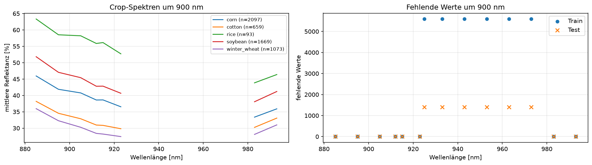

# Explorative Datenanalyse (EDA)

Ergebnisse der EDA auf `train.csv` (und `test.csv` zum Vergleich). Jedes EDA-Issue füllt seinen
Abschnitt mit kurzen Stichpunkten und den wichtigsten Plots. Die Analysen selbst liegen in den
Notebooks unter `notebooks/`.

!!! info "So arbeiten wir hier"
    - Plots mit `awp2.plots` erzeugen, z. B. `plot_spectra(df, by="Crop")`.
    - Plots für diese Seite mit `save_doc_figure(fig, "<name>")` speichern (landen in
      `docs/daten/img/`) und einbinden: ``.
    - Nur beschreiben und markieren – Daten werden erst in der Data Preparation verändert.

## EDA-Fahrplan: Fragen zuerst klären

Eine Zeile ist ein Spektrum einer landwirtschaftlichen Fläche: 198 Reflektanzwerte entlang der
Wellenlänge sowie `AEZ` und `Month`; nur `train.csv` enthält `Crop` und `Stage`. Die EDA prüft,
welche beobachtbaren Muster und Risiken diese Felder enthalten. Sie wählt noch keine Merkmale
und bewertet keine Modelle. Insbesondere beweist ein sichtbarer Unterschied zwischen Gruppen
noch nicht, dass er auf unbekannten Daten vorhersagekräftig ist.

Wir laden die Daten ausschließlich über `awp2.data.load_train()` und `load_test()`. Bandspalten
werden über `band_columns()` und ihre Wellenlängen über `wavelengths()` bestimmt. Die folgenden
Schritte sind in dieser Reihenfolge auszuführen; das Ergebnis jedes Schritts wird in den
passenden Abschnitt weiter unten eingetragen.

| Priorität | Konkrete Frage und Datenbezug | Analyse und festzuhaltendes Ergebnis | Konsequenz oder Grenze |
| --- | --- | --- | --- |
| 1 | Haben Train und Test dieselbe technisch nutzbare Eingabestruktur? (`AEZ`, `Month`, alle Bandspalten) | Form, Datentypen, IDs, Wertebereiche und Kategorien vergleichen; je Band Anzahl fehlender Werte, konstante Werte sowie Min/Median/Max dokumentieren. Fehlende Bänder als Wellenlängenbereiche darstellen. | Vollständig leere Bänder sind keine Modellinformation. Einzelne Lücken und auffällige Werte sind zunächst Befunde, keine Cleaning-Entscheidung. |
| 2 | Treten Lücken oder auffällige Spektren systematisch in bestimmten Gruppen auf? (fehlende Werte, `AEZ`, `Month`, `Crop`, `Stage`) | Für teilweise fehlende Bänder die betroffenen Zeilen nach Metadaten und Labels auszählen. Spektren mit robusten Kennzahlen und Einzelplots prüfen, besonders an Bandgrenzen sowie um `X912`–`X925`. | Klärt, ob fehlende Werte zufällig wirken oder mit einer beobachteten Gruppe zusammenhängen. Die Ursache (Sensor, Atmosphäre oder Export) bleibt ohne Erstellungsdokumentation offen. |
| 3 | Gibt es identische oder fast identische Beobachtungen, die einen zufälligen Split verfälschen könnten? (`AEZ`, `Month`, verfügbare Bänder, Labels) | Exakte Duplikate und Gruppen sehr ähnlicher Spektren mit einer vorher festgelegten Distanz messen; für jede Gruppe prüfen, ob Labels, Metadaten und die Zugehörigkeit zu Train/Test übereinstimmen. | Liefert ein Leakage-Risiko und mögliche Gruppen für eine spätere Split-Regel. Ohne Koordinaten oder Feld-IDs beweist Ähnlichkeit keine gemeinsame Fläche. |
| 4 | Welche Labels und Crop-Stage-Paare sind selten oder fehlen? (`Crop`, `Stage`) | Häufigkeiten, Anteile und die Kreuztabelle `Crop` x `Stage` erstellen; kleinste Paarhäufigkeit gegen 70/30-Split und fünf CV-Folds prüfen. | Begründet Stratifizierung nach `Crop|Stage`, klassenfaire Kennzahlen und eine vorsichtige Interpretation seltener Paare. Fehlende Paare sind ein Stichprobenbefund, keine Aussage über landwirtschaftliche Unmöglichkeit. |
| 5 | Können `AEZ` oder `Month` die Labels stark vorstrukturieren? (`AEZ` x `Crop`, `Crop` x `Month` x `Stage`) | Kreuztabellen und normierte Anteile je Kultur zeigen; innerhalb jeder Kultur die Monatsverteilung je Stadium vergleichen. Zusätzlich die Verteilung von `AEZ` und `Month` zwischen Train und Test gegenüberstellen. | Macht legitime Kontextinformation und mögliches Shortcut-Lernen sichtbar. Es klärt nicht, ob `Month` ein tatsächlicher Aufnahmemonat ist oder ob Metadaten in der finalen Vorhersage verfügbar sein werden. |
| 6 | Unterscheiden sich die Spektren nach Kultur und innerhalb einer Kultur nach Stadium? (verfügbare Bänder, `Crop`, `Stage`) | Median und Interquartilsbereich je Kultur über der Wellenlänge plotten. Danach denselben Plot je `Stage` innerhalb jeder Kultur erstellen und die Gruppengröße sichtbar ausweisen. VIS, Red Edge, NIR und SWIR getrennt vergleichen. | Prüft die fachlichen Hypothesen zu Chlorophyll, Blattstruktur und Wasserstatus an den Daten. Überlappende Bereiche, ungleiche Gruppengrößen und Mischpixel bleiben Alternativerklärungen. |
| 7 | Gibt es wenige Spektralbereiche mit auffälligen Klassenunterschieden oder stark redundante Bänder? (geordnete Bandspalten, Labels) | Nach dem Qualitätscheck Korrelation benachbarter Bänder, Klassenunterschiede pro Band und eine PCA mit erklärter Varianz und 2D-Projektion erstellen. Leere Bänder bleiben ausgeschlossen. | Erzeugt Hypothesen für Bandauswahl, Glättung oder Dimensionsreduktion. Jede spätere Auswahl oder PCA muss ausschließlich innerhalb der Trainings-Pipeline gelernt werden. |
| 8 | Verhalten sich unbeschriftete Testdaten in den Eingaben anders als Train? (`AEZ`, `Month`, nutzbare Bänder) | Für Metadaten und ausgewählte robuste Spektralkennwerte Verteilungen, Quantile und auffällige Randbereiche von Train und Test vergleichen. | Zeigt mögliche Verteilungsverschiebungen. Ohne Testlabels lässt sich weder die spätere Modellgüte noch eine Labelverteilung im Test bestimmen. |
| 9 | Verdichten vorab definierte Vegetationsindizes die sichtbaren Unterschiede? (nächstgelegene verfügbare Bänder für NDVI, EVI, NDRE, PRI und eine eindeutig benannte NDWI-Variante) | Erst nach Schritt 1–2 die Berechenbarkeit und Verteilungen je Kultur und Stadium prüfen; Formel, Bänder und Umgang mit fehlenden Werten protokollieren. | Dies ist nur eine Feature-Engineering-Hypothese aus der [Vegetationslehre](../domaene/vegetation.md#vegetationsindizes), kein Leistungsnachweis. Ein späterer Vergleich erfolgt innerhalb der Validierungspipeline. |

### Bezug zu den offenen Fragen

| Offene Frage | Was die EDA dazu beitragen kann | Was Daten allein nicht klären können |
| --- | --- | --- |
| [#1: Rolle von `test.csv`](../projekt/offene-fragen.md) | Schritt 1 und 8 prüfen, ob die Eingaben kompatibel wirken. | Ob dies der finale Bewertungsdatensatz ist, kann nur die Aufgabenbetreuung beantworten. |
| [#3: „70/30 Clusterplot-Split“](../projekt/offene-fragen.md) | Schritt 3 zeigt Duplikat- und Ähnlichkeitsgruppen als mögliche Leakage-Gefahr. | Ohne Definition von „Clusterplot“, Koordinaten oder Feld-IDs lässt sich keine räumliche Split-Regel ableiten. |
| [#5: Quelle, Regionen, Jahre und AEZ](../projekt/offene-fragen.md) | Schritt 5 beschreibt die tatsächlich vorkommenden AEZ- und Monatsgruppen. | Codes, Regionen, Jahre und die genaue Challenge-Auswahl benötigen die Originalquelle. |
| [#7: Kriterien der Stage-Labels](../projekt/offene-fragen.md) | Schritt 5–6 prüfen Monats- und Spektralmuster innerhalb jeder Kultur. | Diese Muster definieren keine BBCH-, V/R- oder Zadoks-Zuordnung. |
| [#8: Fehlende Crop-Stage-Kombinationen](../projekt/offene-fragen.md) | Schritt 4 dokumentiert exakt, welche Kombinationen in der Stichprobe fehlen. | Die Ursache kann Selektion, Anbausaison oder Labelbildung sein und ist nicht aus der Kreuztabelle ableitbar. |
| [#9: Bedeutung von `Month`](../projekt/offene-fragen.md) | Schritt 5 quantifiziert den Zusammenhang von Monat und Labels. | Ob `Month` der tatsächliche Aufnahmemonat oder eine nachträgliche Kategorie ist, muss die Quelle bestätigen. |
| [#10: Wiederholte Feldbeobachtungen](../projekt/offene-fragen.md) | Schritt 3 kann exakte und sehr ähnliche Spektren als Verdachtsfälle markieren. | Feldwiederholungen und räumliche Nähe sind ohne räumliche oder Bild-Metadaten nicht nachweisbar. |

Die Fragen #2, #4 und #6 betreffen Termine, die Aufgabeninterpretation beziehungsweise das
Abgabeformat; sie sind nicht mit einer Analyse von `train.csv` oder `test.csv` beantwortbar.

## Zusammenfassung

!!! info "Data Understanding"
    - Train enthält 5.591 und Test 1.397 Beobachtungen mit jeweils 198 Bandspalten. Von diesen Bändern sind in beiden Dateien 67 vollständig leer; 131 enthalten mindestens eine Messung.
    - Die Labels sind unausgewogen: `rice` hat 93 Beobachtungen, `Harvest` 180 und das seltenste beobachtete Crop-Stage-Paar `cotton|Harvest` 11.
    - `AEZ` und `Month` sind mit den Labels assoziiert. Sie können hilfreichen Kontext liefern, aber auch Shortcut-Lernen fördern.
    - Die mittleren Spektren unterscheiden sich nach Kultur und teils nach Stadium innerhalb einer Kultur. Die Gruppen überlappen jedoch sichtbar.
    - Verfügbare Nachbarbänder sind stark redundant; eine PCA mit zwei Komponenten erklärt bereits mehr als 90 % der spektralen Varianz.
    - Das Ausreißer-Screening und die Near-Duplicate-Analyse zeigen Prüf-Kandidaten, aber keinen gesicherten Messfehler und keine belegte Feldzugehörigkeit.

Diese Befunde beschreiben nur die vorliegende Stichprobe. Sie sind kein Leistungsnachweis für ein Modell und ersetzen keine Validierung mit Balanced Accuracy und Macro-F1.

## Datenqualität

- In Train und Test sind jeweils 67 von 198 Bändern vollständig leer; damit bleiben 131 Bänder mit mindestens einer Messung.
- Zusätzlich fehlen in Train Werte in sechs und in Test in drei verfügbaren Bändern. Das betrifft 44 von 5.591 Trainings- und 11 von 1.397 Testzeilen.
- Die verfügbaren Bänder sind nicht konstant. Die gemessenen Reflektanzen liegen in beiden Dateien im positiven Bereich von etwa 0,25 % bis 93,53 %.
- Zwei Gruppen mit jeweils zwei Trainingszeilen haben exakt gleiche Eingaben einschließlich `AEZ` und `Month`. Zwischen Train und Test findet das Notebook weder identische vollständige Eingaben noch identische Spektren.
- Die Ursache der leeren Bänder bleibt ohne technische Metadaten offen. Sie darf nicht allein aus der Lage auf der Spektralachse abgeleitet werden.

!!! warning "Abgleich erforderlich"
    Die Pipeline-Dokumentation enthält einen abweichenden Hinweis zu Train-Test-Duplikaten. Vor einer endgültigen Cleaning-Entscheidung muss dieser mit dem reproduzierbaren Nullbefund des Notebooks abgeglichen werden.

## Labels & Metadaten

- `corn` (2.097 Zeilen) und `soybean` (1.669) dominieren die Crop-Labels; `rice` ist mit 93 Zeilen die seltenste Kultur.
- `Harvest` ist mit 180 Zeilen das seltenste Stadium. Das kleinste beobachtete Crop-Stage-Paar ist `cotton|Harvest` mit 11 Zeilen; mehrere Paare kommen in der Trainingsstichprobe nicht vor.
- Train und Test enthalten dieselben sieben AEZ-Werte und dieselben Monate 5 bis 10. Die Häufigkeiten unterscheiden sich, die Kategorien überlappen aber vollständig.
- Crop-Anteile unterscheiden sich deutlich zwischen AEZ. Innerhalb einzelner Kulturen konzentrieren sich Stage-Labels auf wenige Monate; bei Mais besteht Monat 8 in Train ausschließlich aus `Critical`.
- Für spätere Splits ist daher die Stratifizierung nach `Crop|Stage` erforderlich. Seltene Paare begrenzen die Verlässlichkeit der Validierung; Balanced Accuracy und Macro-F1 sind wichtiger als eine ungewichtete Accuracy.

## Spektrale Signaturen je Klasse

- Die mittleren Spektren unterscheiden sich zwischen den Kulturen in mehreren Bereichen der Spektralachse. Auch innerhalb von Mais und Soja liegen mittlere Stadien-Spektren im NIR und SWIR auseinander.
- Die Streuungsbereiche überlappen teilweise deutlich. Eine Klasse kann deshalb nicht aus einem einzelnen Band oder einer einzelnen Kurve abgeleitet werden.
- Die sieben AEZ haben unterschiedliche mittlere Spektren, besonders im NIR und SWIR. Da sich zugleich ihre Crop-Anteile unterscheiden, ist dies kein Nachweis eines eigenständigen Klima- oder Bodeneffekts.
- Die Mediane von NDVI, NDRE und NDWI unterscheiden sich zwischen Kulturen und Stadien; PRI trennt die Gruppen weniger klar. Die Indizes bleiben Kandidaten für einen späteren Pipeline-Vergleich.

## Korrelation & Dimensionalität

- Benachbarte verfügbare Bänder sind meist nahezu perfekt korreliert (Median: 0,999). Niedrigere Werte entstehen hauptsächlich an größeren Lücken der Spektralachse.
- Die größten univariaten Crop-Unterschiede liegen im sichtbaren Bereich um 600 bis 700 nm. Für Stage liegen die größten F-Werte am Übergang zum NIR um 760 bis 875 nm sowie im SWIR.
- Nach Standardisierung erklären bereits zwei Hauptkomponenten mehr als 90 % der spektralen Varianz. In der zweidimensionalen Projektion überlappen Crop- und Stage-Gruppen jedoch sichtbar.
- Diese Ergebnisse begründen Varianten mit PCA oder Bandauswahl, aber keine Auswahl außerhalb einer Pipeline: PCA und jede Auswahl müssen ausschließlich auf dem jeweiligen Trainingsanteil gelernt werden.

## Ausreißer & Auffälligkeiten

- Das Sprung-Screening markiert einzelne Spektren mit großen lokalen Änderungen, besonders bei Bandpaaren um 1.000 bis 1.700 nm. Die Kandidaten weichen vom mittleren Verlauf ab, belegen aber keinen Messfehler.
- `X912`, `X915` und `X923` sind in Train und Test vollständig belegt. Von `X925` bis `X973` fehlen sechs aufeinanderfolgende Bänder in beiden Dateien vollständig. Bis `X923` zeigt sich kein sichtbarer Einzelbandsprung in den mittleren Crop-Kurven.
- Nach Ausschluss exakter Duplikate liegen die ähnlichsten Spektralpaare bei standardisierten Distanzen von etwa 0,54 bis 0,64. Die Verteilung ist kontinuierlich und liefert keinen natürlichen Schwellenwert für dieselbe Fläche.
- Ohne Koordinaten, Feld-IDs oder Bild-IDs belegen ähnliche Spektren weder eine Feldwiederholung noch eine räumliche Nähe.

## Cleaning-Empfehlungen

| Thema | Befund | Empfehlung | Begründung |
| --- | --- | --- | --- |
| Leere Bänder | 67 Bänder sind in Train und Test vollständig leer. | Im jeweiligen Trainingsanteil entfernen. | Vollständig leere Bänder enthalten keine Messinformation. |
| Einzelne NaNs | Sechs verfügbare Bänder in Train und drei in Test haben einzelne Lücken. | Nach Entfernen leerer Bänder je Spektrum entlang der Wellenlänge interpolieren; vollständig leere Spektren nur mit einem im Training gelernten Median behandeln. | Benachbarte Bänder sind stark korreliert; der Verlauf desselben Spektrums nutzt lokale Information. |
| Duplikate | Zwei Paare von Trainingszeilen sind exakt gleich. | Vor dem gemeinsamen Split entfernen; den abweichenden Train-Test-Hinweis in der Pipeline-Dokumentation prüfen. | Exakte Wiederholungen können einen zufälligen Split optimistisch machen. |
| Ausreißer | Sprung-Screening und Near-Duplicates liefern Kandidaten, aber keinen belegten Messfehler. | Keine automatische Zeilenentfernung. Eine spätere Regel nur im Trainingsanteil festlegen und gegen die Variante ohne Entfernung validieren. | Die EDA liefert keinen fachlich begründeten Schwellenwert. |
| Glättung / Rauschen | Es gibt keinen EDA-Beleg für eine pauschale Glättung. | Keine Standardglättung; Savitzky-Golay nur als vorab festgelegte Pipeline-Variante vergleichen. | Glättung kann Rauschen reduzieren, aber schmale relevante Strukturen verwischen. |
| Split-Strategie | Labels und Crop-Stage-Paare sind unausgewogen; räumliche Gruppen sind nicht verfügbar. | Nach `Crop|Stage` stratifizieren; Balanced Accuracy und Macro-F1 für Crop und Stage berichten. | Seltene Paare sollen in Training und Validierung vertreten bleiben. Eine räumliche Gruppenvalidierung ist ohne Feld- oder Bild-IDs nicht ableitbar. |

Alle lernbaren Schritte gehören in eine sklearn-`Pipeline` und werden pro Trainingsfold angepasst. `AEZ`, `Month`, Indizes, PCA und eine mögliche Bandauswahl werden jeweils als getrennte Varianten mit und ohne Metadaten verglichen.
