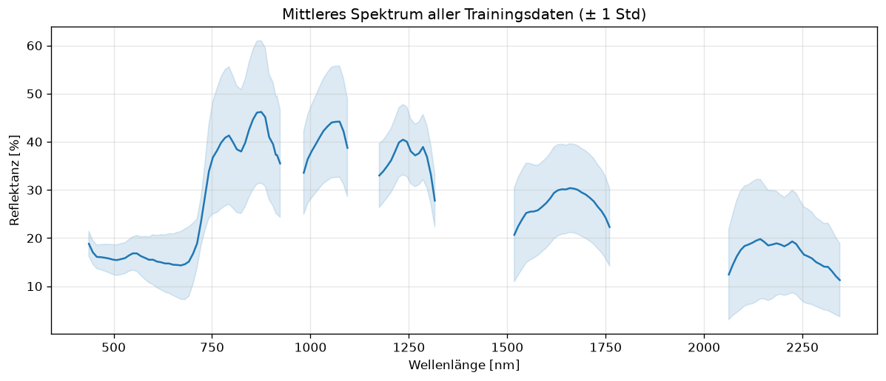

# Explorative Datenanalyse (EDA)

Ergebnisse der EDA auf `train.csv` (und `test.csv` zum Vergleich). Jedes EDA-Issue füllt seinen
Abschnitt mit kurzen Stichpunkten und den wichtigsten Plots. Die Analysen selbst liegen in den
Notebooks unter `notebooks/`.

!!! info "So arbeiten wir hier"
    - Plots mit `awp2.plots` erzeugen, z. B. `plot_spectra(df, by="Crop")`.
    - Plots für diese Seite mit `save_doc_figure(fig, "<name>")` speichern (landen in
      `docs/daten/img/`) und einbinden: ``.
    - Nur beschreiben und markieren – Daten werden erst in der Data Preparation verändert.

## Zusammenfassung

!!! todo "#20 – Synthese & Cleaning-Empfehlung"
    - Die wichtigsten Befunde in 5–10 Stichpunkten, fachlich eingeordnet (→ [Domäne](../domaene/index.md))
    - Textbaustein „Data Understanding" für den M1-Kurzreport

## Datenqualität

!!! todo "#15"
    - Fehlende Werte je Band (Muster, train vs. test), Zeilen mit einzelnen NaNs
    - Exakte und Beinahe-Duplikate, Wertebereiche, Verteilungen je Band
    - Vergleich train vs. test (AEZ, Month, Spektren)

## Labels & Metadaten

!!! todo "#16"
    - Verteilung Crop und Stage, Kreuztabelle Crop × Stage
    - AEZ × Crop, Month × Stage je Kultur
    - Folgerungen für Stratifizierung und Klassenungleichgewicht

## Spektrale Signaturen je Klasse

!!! todo "#17"
    - Mittlere Spektren je Kultur, je Stadium innerhalb jeder Kultur, je AEZ
    - Trennkraft je Band (z. B. ANOVA-F), Bereiche mit den größten Unterschieden

## Korrelation & Dimensionalität

!!! todo "#18"
    - Korrelationsmatrix der Bänder
    - PCA: erklärte Varianz, 2D-Projektion nach Crop/Stage
    - Hinweise für die Bandreduktion (M3)

## Ausreißer & Auffälligkeiten

!!! todo "#19"
    - Auffällige Spektren je Klasse, Spitzen/Sprünge, verrauschte Bänder
    - Überlappung X912–X925
    - Gruppen fast identischer Spektren (gleiches Feld?) als Leakage-Risiko

## Cleaning-Empfehlungen

!!! todo "#20"
    | Thema | Befund | Empfehlung | Begründung |
    | --- | --- | --- | --- |
    | Leere Bänder | | | |
    | Einzelne NaNs | | | |
    | Duplikate | | | |
    | Ausreißer | | | |
    | Glättung / Rauschen | | | |
    | Split-Strategie | | | |
