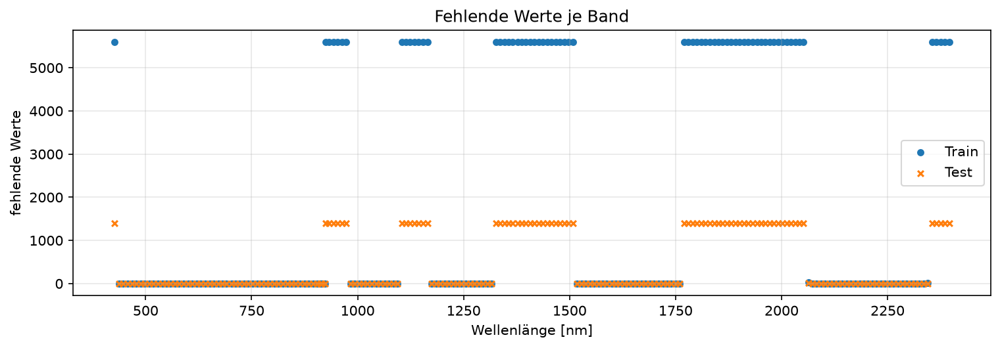
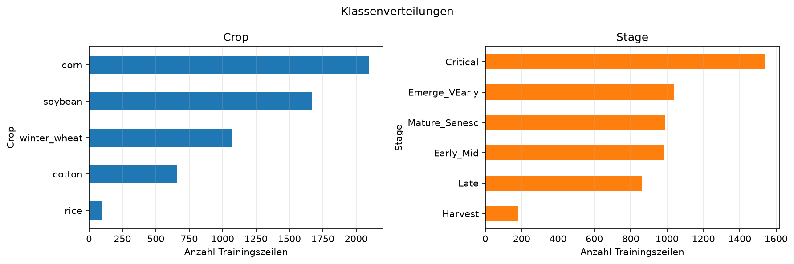
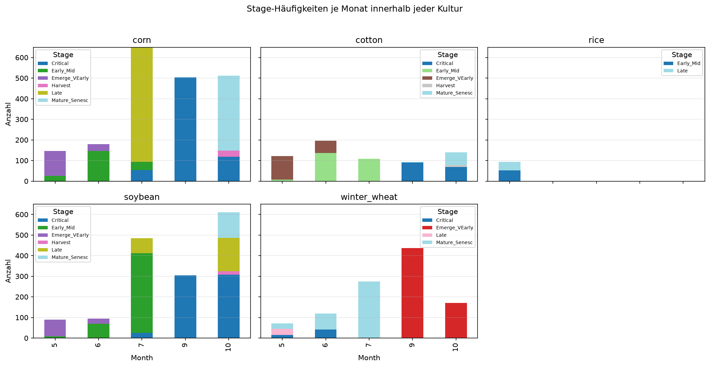
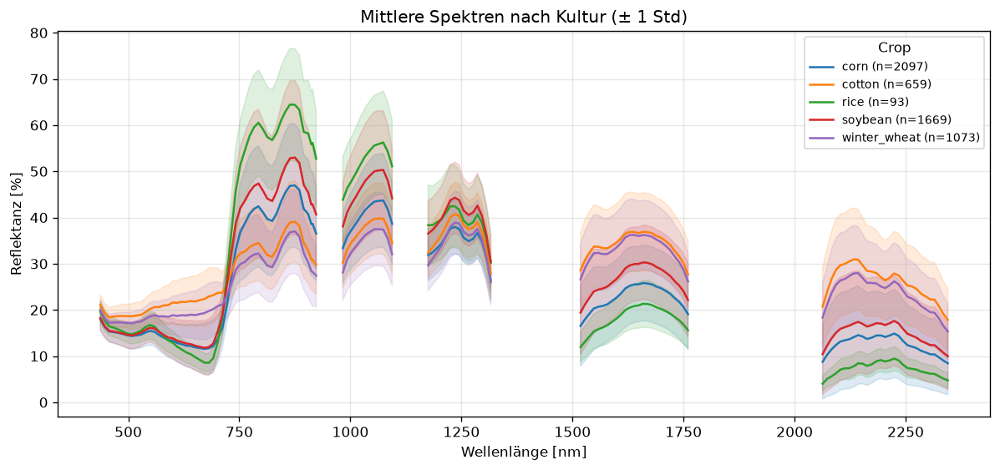
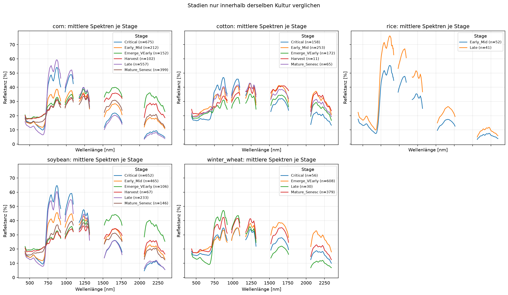
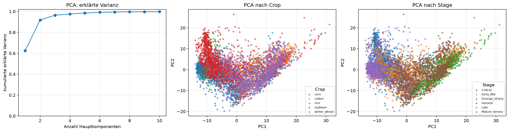

# Kurzbericht: Data Understanding & EDA

**Meilenstein 1 · Stand: 03.10.2026**

## Ziel und Datengrundlage

Wir klassifizieren für jede hyperspektrale Beobachtung gleichzeitig die Kulturart (`Crop`) und
das Entwicklungsstadium (`Stage`). Die Trainingsdaten enthalten 5.591 Beobachtungen mit 198
Spektralbändern von 427 bis 2.395 nm sowie den Kontextmerkmalen `AEZ` und `Month`; im
unbeschrifteten Testdatensatz liegen 1.397 Beobachtungen vor.

Das Projekt untersucht, ob satellitengestützte Reflexionsmessungen Kulturart und
Entwicklungsstadium automatisch unterscheiden können. Solche Informationen können
Feldbegehungen bei der Beobachtung großer oder schwer zugänglicher Gebiete ergänzen und etwa
für Beratung, Agrarstatistik oder Ernteplanung relevant sein. Wir bewerten jedoch nur die
Vorhersagequalität im vorliegenden Datensatz, nicht den Nutzen für eine konkrete Entscheidung.
Die fachliche Grundlage und die Grenzen dieser Einordnung beschreibt die
[Domänendokumentation](../domaene/index.md).

Dieser Bericht fasst die Befunde zusammen, die Entscheidungen für Split, Vorverarbeitung und
Modellvergleich bestimmen. Die vollständige, reproduzierbare Analyse steht in der
[EDA-Dokumentation](eda.md).

## 1. Messdaten sind unvollständig, aber Train und Test sind strukturell kompatibel

67 von 198 Bändern sind in Train und Test vollständig leer. Weitere Lücken betreffen 44
Trainings- und 11 Testzeilen in wenigen sonst verfügbaren Bändern. Alle sieben `AEZ`-Werte und
die Monate 5 bis 10 kommen in beiden Datensätzen vor. Zwei Paare im Training haben identische
Eingaben; zwischen Train und Test gibt es keine identischen vollständigen Spektren.

**Konsequenz:** Vollständig leere Bänder werden entfernt. Einzelne Lücken werden innerhalb jedes
Trainingsfolds entlang der Wellenlänge interpoliert. Exakte Trainingsduplikate werden vor dem
gemeinsamen Split entfernt. Die Ursache der leeren Bänder ist ohne technische Metadaten nicht
belegt und wird daher nicht weiter interpretiert.

## 2. Labels erfordern einen klassenfairen Split und klassenfaire Metriken

Die Kulturarten und Stadien sind unausgewogen. `rice` hat 93 Beobachtungen, `Harvest` 180; das
seltenste beobachtete Crop-Stage-Paar `cotton|Harvest` besteht aus 11 Beobachtungen. Mehrere
Kombinationen fehlen in der Stichprobe vollständig.

**Konsequenz:** Der Holdout-Split und die Cross-Validation werden nach `Crop|Stage`
stratifiziert. Modellläufe berichten Balanced Accuracy und Macro-F1 getrennt für `Crop` und
`Stage`, nicht nur die ungewichtete Accuracy. Fehlende Paare sind ein Stichprobenbefund, keine
fachliche Regel.

## 3. `AEZ` und `Month` sind starke, potenziell fragile Kontextinformation

Die Verteilung von Kulturarten unterscheidet sich zwischen den AEZ. Innerhalb einzelner Kulturen
konzentrieren sich die Stadien auf wenige Monate; bei `corn` kommt Monat 8 im Training nur mit
`Critical` vor. Damit können die Metadaten nützlichen Kontext enthalten, aber auch Ort oder
Kalender anstelle des Spektrums ausnutzen.

**Konsequenz:** Jeder Modellansatz wird mit und ohne `AEZ` und `Month` verglichen. Ein guter
Score mit Kontext ist keine Aussage darüber, wie robust ein Modell bei räumlich oder zeitlich
anders verteilten Daten ist.

## 4. Die Spektren enthalten Klassensignale, überlappen aber sichtbar

Die mittleren Spektren unterscheiden sich zwischen Kulturen. Auch die mittleren Stadien-Spektren
liegen innerhalb einer Kultur, besonders im NIR und SWIR, teilweise auseinander. Die
Streuungsbereiche überlappen jedoch deutlich; einzelne Bänder oder Kurven können die Labels
nicht eindeutig bestimmen.

**Konsequenz:** Die vollständige Spektralform bleibt die zentrale Modellinformation. Vorab
sichtbare Gruppenunterschiede sind Hypothesen und werden erst über Cross-Validation bewertet.

## 5. Spektralbänder sind stark redundant; Dimensionsreduktion ist eine spätere Variante

Benachbarte verfügbare Bänder sind nahezu perfekt korreliert (Median 0,999). Bereits zwei
standardisierte Hauptkomponenten erklären mehr als 90 % der spektralen Varianz. Die 2D-Projektion
zeigt jedoch weiterhin Überlappungen der Crop- und Stage-Gruppen.

**Konsequenz:** PCA und Bandauswahl sind plausible, aber noch unbewertete Varianten. Beide müssen
innerhalb der Pipeline ausschließlich auf den Daten des jeweiligen Trainingsfolds gelernt werden.

## 6. EDA-Ergebnis für die erste Pipeline

| Befund | Entscheidung für M1 |
| --- | --- |
| Leere und vereinzelt fehlende Bänder | Leere Bänder entfernen, verbleibende Lücken spektral interpolieren. |
| Exakte Duplikate im Training | Vor dem festen Split entfernen. |
| Seltene Crop-Stage-Paare | Nach `Crop|Stage` stratifizieren und klassenfaire Metriken verwenden. |
| Kontextabhängigkeit | Varianten mit und ohne `AEZ`/`Month` getrennt bewerten. |
| Redundante Spektren | Rohbänder zunächst als Referenz; PCA und Bandauswahl später kontrolliert vergleichen. |
| Ausreißer-Kandidaten ohne belegten Messfehler | Keine automatische Zeilenentfernung. |

Die daraus entstandene Pipeline erzeugt reproduzierbar bereinigte Daten und einen festen Split.
Die Random-Forest-Baseline wird per Cross-Validation auf dem Trainingsanteil gewählt und genau
einmal auf dem Holdout bewertet; die Experimente sind in MLflow und im
[Experiment-Log](../modelle/experimente.md) dokumentiert.

## Offene Punkte und M2

- Sind `Month` und `AEZ` in der späteren Anwendung ausdrücklich zulässige und verfügbare
  Eingabemerkmale?
- Gibt es Feld-, Bild- oder räumliche Gruppen für eine realistischere Validierung?
- Wie sind die Stage-Labels fachlich definiert, und welche Vorverarbeitung lag vor dem
  Challenge-Export bereits vor?

In Meilenstein 2 vergleichen wir Spektren, Kontext und kombinierte Eingaben kontrolliert,
untersuchen Confusion Matrices und erzwingen gegebenenfalls gültige Crop-Stage-Kombinationen.
