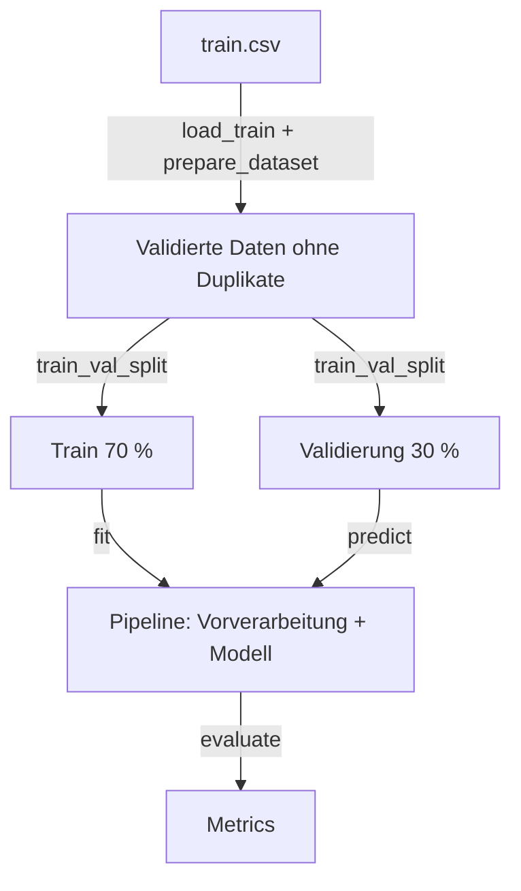

# Data Pipeline

Gemeinsame Grundlage für alle Modelle: gleiche Daten, gleicher Split, gleiche Vorverarbeitung,
gleiche Metriken. Nur so sind Ergebnisse im [Experiment-Log](../modelle/experimente.md)
vergleichbar.

```python
from sklearn.ensemble import RandomForestClassifier
from awp2.config import SEED
from awp2.experiment import CombinedLabelClassifier, RunConfig, run
from awp2.preprocessing import PreprocessingConfig

forest = RandomForestClassifier(class_weight="balanced", random_state=SEED)
model = CombinedLabelClassifier(forest)
config = RunConfig(
    name="rf_combined",
    preprocessing=PreprocessingConfig(use_meta=True, scale=False),
)

result = run(model, config)
result.metrics.bacc_combined  # alle Metriken als Felder: bacc_crop, f1_samples, …
```

## Konfiguration

Alles außer dem Modell selbst wird über typisierte Konfigurationsobjekte (pydantic) festgelegt.
Sie prüfen Eingaben sofort und streng – ein Tippfehler im Feldnamen oder `scale="yes"` statt
`scale=True` führt zu einem Fehler statt zu stillem Fehlverhalten – und sind unveränderlich.

| Objekt | Felder | Standard |
| --- | --- | --- |
| `PreprocessingConfig` | `use_meta` – AEZ/Month als Features · `scale` – Standardisierung | `True` · `False` |
| `RunConfig` | `name` (klein, z. B. `svm_combined`) · `preprocessing` · `balance_samples` | – · Standard · `False` |
| `Metrics` (Ergebnis) | `bacc_crop/stage/combined`, `f1_macro_crop/stage/combined`, `f1_samples`, `invalid_combinations` | – |

Neue Vorverarbeitungsschritte bekommen ein Feld in `PreprocessingConfig` und einen Transformer in
`awp2.preprocessing` – nicht eigenen Code im Notebook.

## Ablauf



| Schritt | Code | Was | Warum |
| --- | --- | --- | --- |
| Laden | `awp2.data.load_train()` | CSV lesen, pandera-Schema prüfen, Index = `id` | Formatfehler sofort sehen |
| Duplikate | `prepare_dataset()` | 2 exakt doppelte Zeilen entfernen | Sonst kann dieselbe Messung in Train **und** Val landen (Leakage) |
| Split | `train_val_split()` | Fixer 70/30-Holdout, stratifiziert auf Crop+Stage, `SEED` | Vorgabe M1; alle vergleichen auf denselben Daten; seltene Kombis (z. B. `cotton|Harvest`, 11 Zeilen) in beiden Teilen |
| Leere Bänder | `DropEmptyBands` | 67 Bänder ohne jeden Wert entfernen → 131 Bänder | Keine Information (Wasserabsorption/Randbänder, siehe [EDA](eda.md)) |
| Lücken | `InterpolateBands` | Fehlende Werte je Spektrum füllen: zwischen zwei Bändern linear nach Wellenlänge, am Rand mit dem nächsten gemessenen Band, ohne jeden Wert mit dem Trainings-Median | Nachbarbänder sind stark korreliert, Spektren unterschiedlich hell (Nachbar schätzt besser als globaler Median); 43 Zeilen train und **11 Zeilen test** betroffen – muss auch bei der Vorhersage greifen |
| Metadaten | `PreprocessingConfig(use_meta=True)` | `AEZ` One-Hot, `Month` numerisch | Laut Aufgabe erlaubt; abschaltbar, um den Nutzen zu messen |
| Skalierung | `PreprocessingConfig(scale=True)` | StandardScaler | Für SVM, logistische Regression, MLP; bei Baum-Modellen unnötig |

Alle Schritte stecken in einer sklearn-`Pipeline` und werden **nur auf dem Train-Split gefittet**.

### Warum stratifiziert?

Ein zufälliger Split kann seltene Klassen ungleich verteilen: Von den 11 Zeilen `cotton|Harvest`
könnten zufällig alle im Training landen – dann lässt sich diese Klasse gar nicht bewerten, und
die Balanced Accuracy schwankt je nach Zufall stark. **Stratifiziert** heißt: Der Split behält den
Anteil jeder Klasse in beiden Teilen bei (hier je Crop/Stage-Paar, 70 % / 30 %). Weil
`train_test_split` und `StratifiedKFold` dafür nur *eine* Klasse pro Zeile akzeptieren, bilden wir
dafür den Schlüssel `Crop|Stage` (`combined_label`).

## Zwei Ziele vorhersagen

`run()` erwartet ein Modell, das Crop **und** Stage liefert:

| Variante | Wie | Hinweis |
| --- | --- | --- |
| Multi-Output | Modell direkt, z. B. `RandomForestClassifier` (kann nativ mehrere Ziele) oder `MultiOutputClassifier(...)` | Kann unmögliche Kombinationen vorhersagen |
| Kombiniertes Label | `CombinedLabelClassifier(modell)` – trainiert auf `Crop|Stage` | Sagt nur Kombinationen aus dem Training vorher |

!!! warning "Werkzeug, keine Entscheidung"
    Beide Varianten sind nur Bausteine, damit jeder Ansatz über dieselbe Schnittstelle läuft.
    Welcher Ansatz fachlich sinnvoll ist, wird in [Ansätze](../modelle/ansaetze.md) recherchiert
    und begründet. Das kombinierte Label modelliert die gemeinsame Verteilung von Kultur und
    Stadium als 23 unabhängige Klassen: Es nutzt nicht, dass das Stadium von der Kultur abhängt,
    und teilt kein Wissen zwischen z. B. `corn|Late` und `soybean|Late`.

Die Kennzahl `invalid_combinations` zeigt den Anteil unmöglicher Vorhersagen; `run()` warnt,
wenn er über 0 liegt. Weitere Ansätze
(hierarchisch, Multi-Task): [Ansätze](../modelle/ansaetze.md).

## Klassenungleichgewicht

- Modelle mit `class_weight` (Random Forest, logistische Regression, SVM): `class_weight="balanced"`.
- Modelle ohne (XGBoost, HistGradientBoosting, MLP): `RunConfig(..., balance_samples=True)` übergibt
  ausgeglichene `sample_weight` je Crop+Stage-Kombination.

## Tuning & Cross-Validation

!!! warning "Der 30-%-Holdout ist nur für den Endvergleich"
    Wer Hyperparameter so lange ändert, bis der Holdout-Score gut ist, tuned auf den
    Validierungsdaten – der Score wird zu optimistisch. Tuning daher per Cross-Validation
    **nur auf dem Train-Teil**.

```python
from sklearn.linear_model import LogisticRegression
from sklearn.model_selection import GridSearchCV
from sklearn.pipeline import Pipeline
from awp2.data import cv_splits, load_train, prepare_dataset, train_val_split
from awp2.evaluation import scorer
from awp2.experiment import CombinedLabelClassifier
from awp2.preprocessing import PreprocessingConfig, build_preprocessor

X, y = prepare_dataset(load_train())
X_train, X_val, y_train, y_val = train_val_split(X, y)
pipeline = Pipeline([
    ("preprocess", build_preprocessor(PreprocessingConfig(scale=True))),
    ("model", CombinedLabelClassifier(LogisticRegression(max_iter=2000))),
])
search = GridSearchCV(pipeline, {"model__estimator__C": [0.1, 1, 10]},
                      scoring=scorer("bacc_combined"), cv=list(cv_splits(X_train, y_train)))
search.fit(X_train, y_train)
search.best_params_
```

`scoring=scorer(...)` ist nötig, weil sklearns Standard-Score nicht mit zwei Zielspalten umgehen
kann. Findet die EDA Gruppen zusammengehöriger Spektren (z. B. dasselbe Feld), `groups=` an
`cv_splits` übergeben → jede Gruppe bleibt in einem Fold.

## Offen – kommt nach der EDA (#20, #30)

- Glättung der Spektren (z. B. Savitzky-Golay)
- Umgang mit Ausreißern
- Bandauswahl, Vegetationsindizes als Features
- Split-Strategie, falls räumliche Cluster gefunden werden
- 2 Spektren in `test.csv` sind identisch mit Trainingszeilen – für die EDA (#15) notiert
- `Month` ist zyklisch; ggf. als sin/cos kodieren und den Nutzen der Metadaten messen
