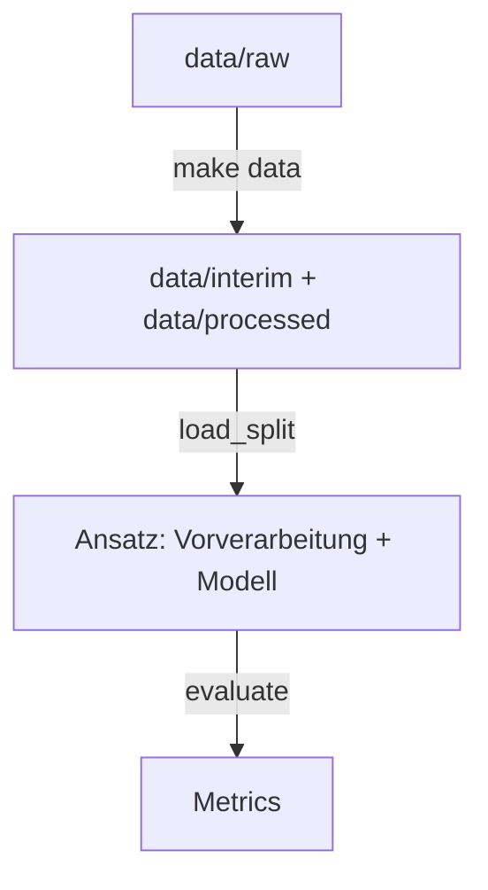

# Pipeline nutzen

Die Pipeline liefert allen Ansätzen dieselben bereinigten Daten, denselben Split, dieselbe
Vorverarbeitung und dieselben Metriken. Ein Modell enthält sie bewusst nicht – das baut jeder
[Ansatz](../modelle/ansaetze/index.md) selbst. Warum sie so gebaut ist: [Warum so?](pipeline-entscheidungen.md) ·
alle Funktionen im Detail: [API-Referenz](../referenz/data.md).



## 1. Artefakte erzeugen

```bash
make data   # nach dem Kopieren der Rohdaten und wenn sich die Pipeline ändert
```

| Datei | Inhalt |
| --- | --- |
| `data/interim/train_clean.parquet` | Validierte Trainingsdaten ohne Duplikate |
| `data/processed/split.csv` | Je `id`: `subset` (`train`/`val`) und `cv_fold` (0–4) |

Die Dateien sind nicht in git, aber deterministisch – bei allen byte-identisch.

## 2. Einen Ansatz aufsetzen

```python
from sklearn.dummy import DummyClassifier
from sklearn.pipeline import Pipeline

from awp2.data import load_split, valid_combinations
from awp2.evaluation import as_target_frame, evaluate
from awp2.preprocessing import PreprocessingConfig, build_preprocessor

split = load_split()
model = Pipeline([
    ("preprocess", build_preprocessor(PreprocessingConfig(scale=True))),
    ("model", DummyClassifier(strategy="most_frequent")),  # ← euer Ansatz
])
model.fit(split.X_train, split.y_train)
y_pred = as_target_frame(model.predict(split.X_val), split.y_val.index)

metrics = evaluate(split.y_val, y_pred, valid_combinations(split.y_train))
metrics.bacc_combined
```

| Kommt aus der Pipeline | Baut jeder Ansatz selbst |
| --- | --- |
| Daten und Split: [`load_split`][awp2.data.artifacts.load_split] | Das Modell und wie es Crop **und** Stage vorhersagt |
| Vorverarbeitung: [`build_preprocessor`][awp2.preprocessing.build_preprocessor] | Zusätzliche Schritte → neues Feld in [`PreprocessingConfig`][awp2.preprocessing.PreprocessingConfig] |
| Bewertung: [`evaluate`][awp2.evaluation.evaluate] → [`Metrics`][awp2.evaluation.Metrics] | Tuning, Begründung in [Ansätze](../modelle/ansaetze/index.md), Zeile im [Experiment-Log](../modelle/experimente.md) |

Die lineare Interpolation einzelner Bandlücken ist standardmäßig auf Stützbänder mit höchstens
15 nm Abstand begrenzt. Bei größeren Abständen wird der nähere Messwert übernommen; die Grenze
lässt sich über `PreprocessingConfig(max_interpolation_gap_nm=...)` anpassen.

`AEZ` wird one-hot-kodiert. Standardmäßig ersetzt die zyklische Kodierung den numerischen
`Month` durch `Month_sin` und `Month_cos` mit einer Jahresperiode von 12 Monaten. Bei
`scale=True` werden diese beiden Merkmale mit dem Trainingsfold skaliert. Für den Vergleich mit
der numerischen Monatszahl kann `PreprocessingConfig(use_cyclic_month=False)` gesetzt werden.

### Dimensionsreduktion

Alle Verfahren fassen die 131 Bänder als letzter Spektral-Schritt zusammen; gleichzeitig ist
höchstens eines aktiv. Der Vergleich folgt acht unüberwachten Verfahren auf
Hyperspektraldaten ([Lupu et al.](https://www.researchgate.net/publication/390286182_Quick_unsupervised_hyperspectral_dimensionality_reduction_for_earth_observation_a_comparison)).

| Methode | Feld | Skalierung | Hinweis |
| --- | --- | --- | --- |
| PCA | `spectral_pca_components` | Standard-Scaler oder Zentrierung (`use_spectral_centering`) | Varianz-maximierende Komponenten |
| ICA | `spectral_ica_components` | Standard-Scaler oder Zentrierung | Statistisch unabhängige Komponenten (FastICA, whitened intern) |
| NMF | `spectral_nmf_components` | Keine (rohe Reflektanzen) | Multiplikative Updates; sklearn kennt nur NNDSVD/Random-Init |
| OSP | `spectral_osp_components` | Keine (rohe Spektren) | Automatische Zielgenerierung: iterative Endmember, Projektion darauf |
| LPP | `spectral_lpp_components` + `spectral_lpp_neighbors` | Beliebig | Nachbarschafts-erhaltend, lineare Projektion |
| VSRP | `spectral_vsrp_components` | Keine nötig | Mittelwert-zentrierte Achlioptas-Projektion (c = √d) |
| DBN | `spectral_dbn_layers=(…, k)` | Min-Max-Scaler nötig | Gestapelte Bernoulli-RBMs (nur Vortraining, ohne Fine-Tuning), Eingaben in [0, 1] |

Der CAE ist nicht umgesetzt – er braucht PyTorch/Keras (siehe Abschnitt 4 zum Wrapper-Muster).

### Befunde

Kein Verfahren gewinnt überall: PCA/ICA/OSP sind mit wenigen Bändern am besten (danach Plateau oder Abfall), LPP verbessert sich mit mehr Bändern weiter und klassifiziert am besten, OSP ist am robustesten gegen Streifen-Artefakte, VSRP ist am schnellsten. Für PCA/OSP genügen ca. 200 zufällige Pixel zum Fitten – bei unseren 3912 Trainingszeilen fitten wir trotzdem auf allen.

### Nicht umgesetzt (Ausblick)

- **CAE**: 1D-Convolution entlang der Wellenlänge mit linearer Engstelle – braucht PyTorch/Keras, siehe Abschnitt 4.
- **NMF mit OSP-Init**: sklearn kennt nur NNDSVD/Random-Init; eigene Init-Matrizen bräuchten eine angepasste NMF-Schleife.
- **DBN-Fine-Tuning**: fehlt (Momentum und L1-Strafe per Gradientenabstieg); die RBMs enden nach dem schichtweisen Vortraining.
- **Spalten-sampling-PCA**: reine Beschleunigung für 500k-Pixel-Szenen, bei unserer Datengröße überflüssig.

## 3. Tunen

Hyperparameter nur per Cross-Validation auf dem Train-Teil tunen – der 30-%-Holdout ist für
den Endvergleich reserviert.

```python
from sklearn.model_selection import GridSearchCV

from awp2.data import load_folds
from awp2.evaluation import scorer

search = GridSearchCV(model, {"model__strategy": ["most_frequent", "stratified"]},
                      scoring=scorer("bacc_combined"), cv=load_folds())
search.fit(split.X_train, split.y_train)
```

Modelle einheitlich ausführen und in MLflow vergleichen: [Experimente & MLflow](../entwicklung/tracking.md).

`scoring=scorer(...)` ist nötig, weil sklearns Standard-Score keine zwei Zielspalten kennt.
Für Modelle ohne `class_weight` gegen das Klassenungleichgewicht:
[`balanced_sample_weight`][awp2.data.split.balanced_sample_weight].

## 4. Modelle außerhalb von sklearn (z. B. neuronale Netze)

Daten, Split, Folds und `evaluate()` hängen an keinem Framework. Nur `run()`, `tune()` und
`build_preprocessor()` erwarten die **sklearn-Schnittstelle** – die hat aber jedes Modell, das
in eine kleine Hülle (Wrapper) gepackt wird. Ein Netz in PyTorch, Keras o. Ä. läuft dann
unverändert durch die Pipeline und wird in MLflow protokolliert:

```python
from sklearn.base import BaseEstimator, ClassifierMixin


class SpectralLSTM(BaseEstimator, ClassifierMixin):
    def __init__(self, hidden_size: int = 64, epochs: int = 50) -> None:
        self.hidden_size = hidden_size   # Hyperparameter nur speichern → tune() kann sie setzen
        self.epochs = epochs

    def fit(self, X: pd.DataFrame, y: pd.DataFrame) -> "SpectralLSTM":
        ...  # Labels kodieren, Netz bauen und trainieren
        return self

    def predict(self, X: pd.DataFrame) -> np.ndarray:
        ...  # Array der Form (n, 2): Spalten Crop, Stage
```

| Worauf achten | Warum |
| --- | --- |
| Alle Hyperparameter als Argumente von `__init__`, dort nur speichern | `tune()` kopiert das Modell mit `clone()` und setzt Werte über diese Namen |
| `X` ist ein DataFrame aus Bändern **und** ggf. `AEZ`/`Month` | Für ein LSTM/1D-CNN die Bandspalten zur Sequenz `(n, Bänder, 1)` umformen; Metadaten getrennt einspeisen oder `use_meta=False` |
| Skalierung einschalten (`PreprocessingConfig(scale=True)`) | Netze lernen auf unskalierten Reflektanzen schlecht |
| Seed aus `awp2.config` im Framework setzen | Sonst ist jeder Lauf anders und Vergleiche sind wertlos |
| Kleine Grids, `log_model=False` beim Ausprobieren | `tune()` trainiert jeden Kandidaten 5-mal; das Speichern großer Netze kostet Zeit |

Für PyTorch nimmt [skorch](https://skorch.readthedocs.io/) den Trainings-Code ab; die zwei
Zielspalten muss der Wrapper trotzdem selbst behandeln. Wer die Hülle nicht bauen will, kann
auch ohne `run()` arbeiten: `load_split()`, Vorverarbeitung auf `X_train` fitten, eigenes
Training, dann `evaluate()` – muss Tracking und das Verbot, auf der Validierung zu tunen, dann
aber selbst sicherstellen.
