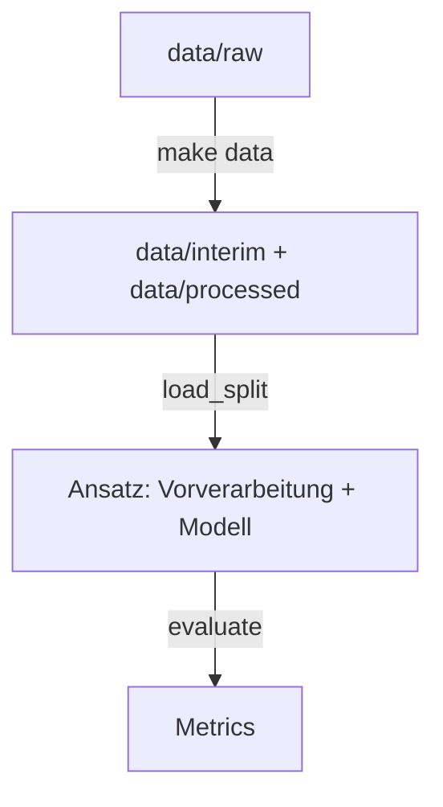

# Pipeline nutzen

Die Pipeline liefert allen Ansätzen dieselben bereinigten Daten, denselben Split, dieselbe
Vorverarbeitung und dieselben Metriken. Ein Modell enthält sie bewusst nicht – das baut jeder
[Ansatz](../modelle/ansaetze/index.md) selbst. Warum sie so gebaut ist: [Warum so?](pipeline-entscheidungen.md) ·
alle Funktionen im Detail: [API-Referenz](../referenz/data.md).



## 1. Artefakte erzeugen

```bash
make data   # nach dem Kopieren der Rohdaten und wenn sich die Pipeline ändert
```

| Datei | Inhalt |
| --- | --- |
| `data/interim/train_clean.parquet` | Validierte Trainingsdaten ohne Duplikate |
| `data/processed/split.csv` | Je `id`: `subset` (`train`/`val`) und `cv_fold` (0–4) |

Die Dateien sind nicht in git, aber deterministisch – bei allen byte-identisch.

## 2. Einen Ansatz aufsetzen

```python
from sklearn.dummy import DummyClassifier
from sklearn.pipeline import Pipeline

from awp2.data import load_split, valid_combinations
from awp2.evaluation import as_target_frame, evaluate
from awp2.preprocessing import PreprocessingConfig, build_preprocessor

split = load_split()
model = Pipeline([
    ("preprocess", build_preprocessor(PreprocessingConfig(scale=True))),
    ("model", DummyClassifier(strategy="most_frequent")),  # ← euer Ansatz
])
model.fit(split.X_train, split.y_train)
y_pred = as_target_frame(model.predict(split.X_val), split.y_val.index)

metrics = evaluate(split.y_val, y_pred, valid_combinations(split.y_train))
metrics.bacc_combined
```

| Kommt aus der Pipeline | Baut jeder Ansatz selbst |
| --- | --- |
| Daten und Split: [`load_split`][awp2.data.artifacts.load_split] | Das Modell und wie es Crop **und** Stage vorhersagt |
| Vorverarbeitung: [`build_preprocessor`][awp2.preprocessing.build_preprocessor] | Zusätzliche Schritte → neues Feld in [`PreprocessingConfig`][awp2.preprocessing.PreprocessingConfig] |
| Bewertung: [`evaluate`][awp2.evaluation.evaluate] → [`Metrics`][awp2.evaluation.Metrics] | Tuning, Begründung in [Ansätze](../modelle/ansaetze/index.md), Zeile im [Experiment-Log](../modelle/experimente.md) |

## 3. Tunen

Hyperparameter nur per Cross-Validation auf dem Train-Teil tunen – der 30-%-Holdout ist für
den Endvergleich reserviert.

```python
from sklearn.model_selection import GridSearchCV

from awp2.data import load_folds
from awp2.evaluation import scorer

search = GridSearchCV(model, {"model__strategy": ["most_frequent", "stratified"]},
                      scoring=scorer("bacc_combined"), cv=load_folds())
search.fit(split.X_train, split.y_train)
```

Modelle einheitlich ausführen und in MLflow vergleichen: [Experimente & MLflow](../entwicklung/tracking.md).

`scoring=scorer(...)` ist nötig, weil sklearns Standard-Score keine zwei Zielspalten kennt.
Für Modelle ohne `class_weight` gegen das Klassenungleichgewicht:
[`balanced_sample_weight`][awp2.data.split.balanced_sample_weight].
