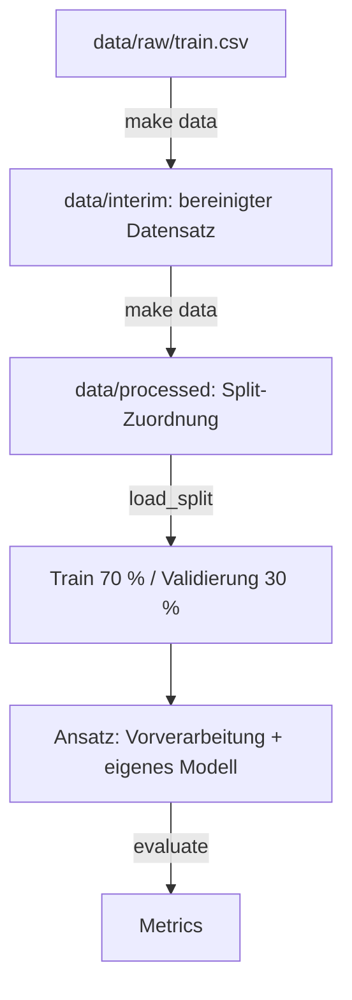

# Data Pipeline

Die Pipeline ist die gemeinsame Grundlage für **alle** Modellansätze: gleiche bereinigte Daten,
gleicher Split, gleiche Vorverarbeitung, gleiche Metriken. Sie enthält bewusst **kein Modell** –
wie Kultur und Stadium vorhergesagt werden, entscheidet jeder Ansatz selbst
([Ansätze](../modelle/ansaetze.md)).

## Überblick



```bash
make data   # einmal nach dem Kopieren der Rohdaten, und wenn sich die Pipeline ändert
```

## Artefakte in `data/`

| Datei | Inhalt | Erzeugt von | In git |
| --- | --- | --- | --- |
| `data/raw/train.csv`, `test.csv` | Rohdaten, nie verändert | per Hand kopiert | nein |
| `data/interim/train_clean.parquet` | Validierte Trainingsdaten ohne Duplikate (Index `id`, Datentypen erhalten) | `make data` | nein |
| `data/processed/split.csv` | Je `id`: `subset` (`train`/`val`) und `cv_fold` (0–4, nur Train-Zeilen) | `make data` | nein |

Beide Artefakte sind **deterministisch** (fester Seed): Wer `make data` ausführt, bekommt
byte-identische Dateien – alle arbeiten auf demselben Split. Passen Datensatz und Split nicht
zusammen oder fehlen sie, melden `load_split()`/`load_folds()` einen Fehler mit dem Hinweis auf
`make data`.

Die **Vorverarbeitung wird nicht gespeichert**: Sie wird in jedem Modell nur auf dem Train-Teil
gefittet (sonst würden Informationen aus der Validierung in das Training gelangen).

## Was die Pipeline bereitstellt – was jeder Ansatz selbst baut

| Die Pipeline stellt bereit | Jeder Ansatz implementiert selbst |
| --- | --- |
| Bereinigte Daten, fixer Split, CV-Folds (`load_split`, `load_folds`) | Das Modell und wie es Crop **und** Stage vorhersagt (getrennt, kombiniert, hierarchisch …) |
| Vorverarbeitung als sklearn-Transformer (`build_preprocessor`) | Eigene zusätzliche Features oder Schritte (→ als neues Feld in `PreprocessingConfig`) |
| Einheitliche Bewertung (`evaluate` → `Metrics`, `scorer` für CV) | Hyperparameter-Tuning auf den CV-Folds |
| Hilfen: `balanced_sample_weight`, `valid_combinations` | Begründung und Ergebnisse in [Ansätze](../modelle/ansaetze.md) und im [Experiment-Log](../modelle/experimente.md) |

### Beispiel: einen Ansatz aufsetzen

Mit einem `DummyClassifier` als Platzhalter – ihn ersetzt ihr durch euren Ansatz.

```python
from sklearn.dummy import DummyClassifier
from sklearn.pipeline import Pipeline

from awp2.data import load_split, valid_combinations
from awp2.evaluation import as_target_frame, evaluate
from awp2.preprocessing import PreprocessingConfig, build_preprocessor

split = load_split()
model = Pipeline([
    ("preprocess", build_preprocessor(PreprocessingConfig(scale=True))),
    ("model", DummyClassifier(strategy="most_frequent")),  # ← euer Ansatz
])
model.fit(split.X_train, split.y_train)
y_pred = as_target_frame(model.predict(split.X_val), split.y_val.index)

metrics = evaluate(split.y_val, y_pred, valid_combinations(split.y_train))
metrics.bacc_combined
```

## Bausteine

| Funktion | Liefert | Wofür |
| --- | --- | --- |
| `load_split()` | `TrainValSplit` (`X_train`, `X_val`, `y_train`, `y_val`) | Der gemeinsame 70/30-Holdout |
| `load_folds()` | `list[Fold]` (`train`, `val` = Zeilenpositionen in `X_train`) | Cross-Validation fürs Tuning |
| `load_dataset()` | `Dataset` (`X`, `y`) | Alle bereinigten Trainingsdaten, z. B. für die EDA |
| `build_preprocessor(config)` | sklearn-`ColumnTransformer` | Standard-Vorverarbeitung, siehe unten |
| `evaluate(y_true, y_pred, valid)` | `Metrics` | Alle Bewertungsmetriken auf einmal |
| `scorer(metric)` | sklearn-Scorer | `scoring=` in `GridSearchCV`/`cross_validate` |
| `valid_combinations(y)` | `frozenset[CropStage]` | Welche Crop/Stage-Paare es gibt |
| `balanced_sample_weight(y)` | Gewichte je Zeile | Ungleichgewicht bei Modellen ohne `class_weight` |

## Datenaufbereitung (`make data`)

| Schritt | Was | Warum |
| --- | --- | --- |
| Laden | CSV lesen, pandera-Schema prüfen | Formatfehler sofort sehen |
| Duplikate | 2 exakt doppelte Zeilen entfernen | Sonst kann dieselbe Messung in Train **und** Validierung landen |
| Split | 70/30, stratifiziert auf Crop+Stage, `SEED` | Vorgabe M1; alle vergleichen auf denselben Daten |
| CV-Folds | 5 stratifizierte Folds im Train-Teil | Tuning ohne den Holdout anzufassen |

### Warum stratifiziert?

Ein zufälliger Split kann seltene Klassen ungleich verteilen: Von den 11 Zeilen `cotton|Harvest`
könnten zufällig alle im Training landen – dann lässt sich diese Klasse gar nicht bewerten, und
die Balanced Accuracy schwankt je nach Zufall stark. **Stratifiziert** heißt: Der Split behält den
Anteil jeder Klasse in beiden Teilen bei (hier je Crop/Stage-Paar). Weil `train_test_split` und
`StratifiedKFold` dafür nur *eine* Klasse pro Zeile akzeptieren, bilden wir dafür den Schlüssel
`Crop|Stage` (`combined_label`). Die Anteile in Train und Validierung weichen dadurch um höchstens
0,05 Prozentpunkte voneinander ab.

## Vorverarbeitung (`build_preprocessor`)

| Option in `PreprocessingConfig` | Standard | Wirkung |
| --- | --- | --- |
| `use_meta` | `True` | `AEZ` One-Hot und `Month` als Features neben dem Spektrum |
| `scale` | `False` | Standardisierung – für SVM, logistische Regression, MLP; bei Baum-Modellen unnötig |

Die Konfiguration ist ein pydantic-Modell: Tippfehler im Feldnamen oder `scale="yes"` statt
`scale=True` führen sofort zu einem Fehler. Neue Schritte bekommen ein Feld hier und einen
Transformer in `awp2.preprocessing`.

| Schritt | Was | Warum |
| --- | --- | --- |
| `DropEmptyBands` | 67 Bänder ohne jeden Wert entfernen → 131 Bänder | Keine Information (Wasserabsorption/Randbänder, siehe [EDA](eda.md)) |
| `InterpolateBands` | Fehlende Werte je Spektrum füllen: zwischen zwei Bändern linear nach Wellenlänge, am Rand mit dem nächsten gemessenen Band, ohne jeden Wert mit dem Trainings-Median | Nachbarbänder sind stark korreliert, Spektren unterschiedlich hell; 43 Zeilen train und **11 Zeilen test** betroffen – muss auch bei der Vorhersage greifen |
| Metadaten | `AEZ` One-Hot, `Month` numerisch | Laut Aufgabe erlaubt; abschaltbar, um den Nutzen zu messen |
| Skalierung | StandardScaler | Nur wenn `scale=True` |

## Bewertung (`evaluate`)

`evaluate()` liefert ein `Metrics`-Objekt mit allen Metriken der Bewertung als Feldern:
`bacc_crop`, `bacc_stage`, `bacc_combined`, `f1_macro_crop`, `f1_macro_stage`,
`f1_macro_combined`, `f1_samples` und – wenn die gültigen Paare übergeben werden –
`invalid_combinations` (Anteil vorhergesagter Crop/Stage-Paare, die es nicht gibt).
Formeln: [Bewertung & Abgabe](../projekt/bewertung.md).

## Tuning & Cross-Validation

!!! warning "Der 30-%-Holdout ist nur für den Endvergleich"
    Wer Hyperparameter so lange ändert, bis der Holdout-Score gut ist, tuned auf den
    Validierungsdaten – der Score wird zu optimistisch. Tuning daher per Cross-Validation
    **nur auf dem Train-Teil**.

```python
from sklearn.ensemble import RandomForestClassifier
from sklearn.model_selection import GridSearchCV
from sklearn.pipeline import Pipeline

from awp2.data import load_folds, load_split
from awp2.evaluation import scorer
from awp2.preprocessing import build_preprocessor

split = load_split()
model = Pipeline([("preprocess", build_preprocessor()), ("model", RandomForestClassifier())])
search = GridSearchCV(model, {"model__max_depth": [10, None]},
                      scoring=scorer("bacc_combined"), cv=load_folds())
search.fit(split.X_train, split.y_train)
```

`scoring=scorer(...)` ist nötig, weil sklearns Standard-Score nicht mit zwei Zielspalten umgehen
kann. Das Modell im Beispiel ist nur ein Platzhalter.

## Klassenungleichgewicht

- Modelle mit `class_weight` (Random Forest, logistische Regression, SVM): `class_weight="balanced"`.
- Modelle ohne (XGBoost, HistGradientBoosting, MLP): `sample_weight=balanced_sample_weight(y_train)`
  an `fit` übergeben – gewichtet je Crop/Stage-Paar.

## Offen – kommt nach der EDA (#20, #30)

- Glättung der Spektren (z. B. Savitzky-Golay)
- Umgang mit Ausreißern
- Bandauswahl, Vegetationsindizes als Features
- Split-Strategie, falls räumliche Cluster gefunden werden (dann Gruppen in `cv_splits`)
- 2 Spektren in `test.csv` sind identisch mit Trainingszeilen – für die EDA (#15) notiert
- `Month` ist zyklisch; ggf. als sin/cos kodieren und den Nutzen der Metadaten messen
