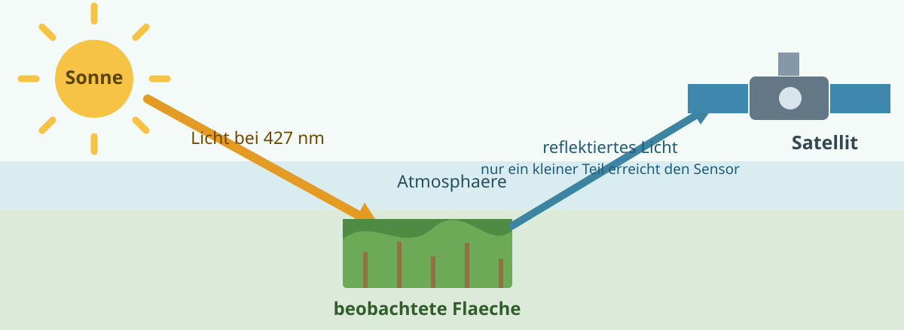

# Fernerkundung & Hyperion

## Grundlagen der optischen Fernerkundung

### Was misst ein passiver optischer Sensor?

Fernerkundung bedeutet, Informationen aus der Entfernung zu gewinnen. Ein passiver optischer
Satellitensensor sendet dabei kein eigenes Licht aus. Er misst tagsüber das Sonnenlicht, das
von der Erdoberfläche reflektiert wird und den Sensor erreicht.[^1] Das gemessene Signal hängt
deshalb nicht nur von der Pflanzenfläche ab, sondern auch von Boden, Atmosphäre und
Aufnahmebedingungen.

### Der Lichtweg in einem Beispiel

Die Bandspalte `X427` beschreibt Licht mit einer Wellenlänge von 427 nm. Vereinfacht läuft
eine Messung so ab: Die Sonne beleuchtet die Fläche, die Atmosphäre verändert das Licht auf
seinem Weg, und die Fläche reflektiert einen Teil des einfallenden Lichts in viele Richtungen.
Nur ein kleiner Teil des reflektierten Lichts erreicht den Satelliten. Aus diesem Messsignal
wird ein Reflektanzwert abgeleitet.

Wichtig ist: Eine Reflektanz von 10 % bei `X427` bedeutet nicht, dass 10 % des Lichts am
Satelliten ankommen. Sie beschreibt den Anteil des auf die Fläche treffenden Lichts bei
427 nm, den die Fläche zurückreflektiert. Wie aus dem Signal am Sensor ein Reflektanzwert
berechnet wurde, hängt von der Datenverarbeitung ab und ist für unseren Datensatz noch offen.

### Reflektanz und die Bandspalten

Die **Reflektanz** ist der Anteil des einfallenden Lichts, den eine Oberfläche bei einer
bestimmten Wellenlänge zurückreflektiert. Sie wird als Verhältnis angegeben und kann deshalb
in Prozent dargestellt werden: Eine Reflektanz von 30 % bedeutet, dass ungefähr 30 % des
einfallenden Lichts dieser Wellenlänge reflektiert werden.

Ein **Spektralband** oder kurz **Band** ist ein kleiner Wellenlängenbereich, für den ein
Sensor einen Reflektanzwert speichert. Die Zahl im Spaltennamen bezeichnet näherungsweise die
Wellenlänge in der Mitte dieses Bereichs. `X427` steht also für ein schmales Lichtfenster um
427 nm, nicht für einen einzelnen Zeitpunkt. Die 198 Spalten `X427` bis `X2395` bilden ein
Spektrum derselben Beobachtung ab, keine zeitliche Folge.

### Wellenlängenbereiche

| Bereich | Ungefährer Bereich | Bezug zu unserem Datensatz |
| --- | --- | --- |
| Sichtbares Licht (VIS) | 400–700 nm | `X427` bis ungefähr `X692` |
| Nahes Infrarot (NIR) | 700–1.300 nm | ungefähr `X702` bis `X1295` |
| Kurzwelliges Infrarot (SWIR) | 1.300–2.500 nm | ungefähr `X1326` bis `X2395` |

Die Grenzen sind Näherungen und können je nach Quelle oder Sensor leicht abweichen.[^2]
Menschen sehen nur den VIS-Bereich; NIR und SWIR liegen außerhalb des sichtbaren Lichts.

### Atmosphäre: TOA- und Oberflächenreflektanz

**Top-of-Atmosphere-Reflektanz (TOA)** beschreibt vereinfacht das Licht, das nach seinem Weg
durch die Atmosphäre am Satelliten ankommt. Dieses Licht enthält sowohl Informationen über die
Fläche als auch Einflüsse der Atmosphäre, etwa von Wasserdampf, Staub oder dünnen Wolken.

**Oberflächenreflektanz** soll dagegen beschreiben, wie stark die Fläche selbst Licht
reflektiert. Sie ist eine Schätzung: Eine atmosphärische Korrektur versucht, die Einflüsse der
Atmosphäre aus dem TOA-Signal herauszurechnen.[^2]

!!! question "Noch offen für unseren Datensatz"
  Die Datendokumentation bezeichnet die Bandwerte nur als Reflexion in Prozent. Ob sie als
  TOA- oder als Oberflächenreflektanz vorliegen und wie sie gegebenenfalls korrigiert wurden,
  muss mit der Originalquelle des Datensatzes geklärt werden. Bis dahin müssen wir diese
  Unsicherheit bei späteren Vorverarbeitungsschritten berücksichtigen und Entscheidungen
  vorsichtig begründen.

[^1]: NASA Earthdata (o. J.), siehe [Quellen](quellen.md).
[^2]: U.S. Geological Survey (o. J.), siehe [Quellen](quellen.md).

## Multispektral vs. hyperspektral

### Viele breite oder viele schmale Bänder?

Ein **multispektraler** Sensor fasst Licht in vergleichsweise wenige, breitere Bereiche
zusammen. Ein **hyperspektraler** Sensor teilt denselben Wellenlängenbereich in viele schmale,
aufeinanderfolgende Bänder. Man kann sich das wie Farbstifte vorstellen: Multispektral
unterscheidet wenige Grundfarben, hyperspektral sehr viele feine Farbabstufungen.

| | Multispektral | Hyperspektral |
| --- | --- | --- |
| Bänder | Wenige, breite Bereiche | Viele, schmale Bereiche |
| Beispiel | Sentinel-2 oder Landsat | EO-1 Hyperion |
| Ergebnis | Groberes Spektrum | Detaillierteres Spektrum |

Unser Datensatz ist hyperspektral: Die 198 Bandspalten `X427` bis `X2395` liegen entlang
derselben Spektralachse. Zwei benachbarte Spalten beschreiben daher sehr ähnliche, aber nicht
identische Lichtbereiche. Je mehr und je schmaler die Bänder sind, desto höher ist die
spektrale Auflösung.[^3]

### Vier Bedeutungen von Auflösung

Das Wort „Auflösung“ kann bei Satellitendaten vier verschiedene Eigenschaften meinen:[^3]

| Art der Auflösung | Einfache Frage | Beispiel für unser Projekt |
| --- | --- | --- |
| Spektral | Wie fein werden Wellenlängen unterschieden? | 198 schmale Bandspalten statt weniger breiter Bänder |
| Räumlich | Wie groß ist ein Pixel am Boden? | Nominal etwa 30 m; siehe nächster Abschnitt |
| Zeitlich | Wie oft wird derselbe Ort erneut beobachtet? | Nicht mit den Bandspalten verwechseln |
| Radiometrisch | Wie fein kann der Sensor kleine Helligkeitsunterschiede speichern? | Die genaue Einstellung ist in unserem Datensatz noch nicht dokumentiert |

### Chance und Herausforderung für unser Projekt

Die vielen schmalen Bänder können feine Unterschiede zwischen Flächen sichtbar machen. Das
ist eine begründete Hypothese dafür, dass sie bei der Unterscheidung von Kulturarten und
Entwicklungsstadien hilfreich sein könnten. Gleichzeitig sind benachbarte Bänder oft sehr
ähnlich, einzelne Bänder können verrauscht sein, und viele Merkmale machen die Modellierung
aufwendiger. In der EDA prüfen wir deshalb Korrelationen zwischen Bändern, fehlende Werte und
auffällige Spektren, bevor wir eine Bandauswahl oder weitere Vorverarbeitung begründen.

[^3]: NASA Earthdata (o. J.), siehe [Quellen](quellen.md).

## Räumliche Auflösung & Mischpixel

### Was bedeutet eine räumliche Auflösung von 30 m?

Die **räumliche Auflösung** beschreibt, wie groß die Fläche am Boden ist, die ein Bildpixel
repräsentiert.[^3] Bei Hyperion bedeutet die nominelle Auflösung von 30 m: Ein Pixel entspricht
ungefähr einer quadratischen Fläche von $30 \times 30$ m, also etwa 900 m². Kleinere Strukturen
innerhalb dieser Fläche kann der Sensor nicht getrennt messen.

Das bedeutet nicht automatisch, dass jede Zeile unseres Datensatzes genau einem einzelnen
30-m-Pixel entspricht. Ob die bereitgestellten Spektren Einzelpixel oder bereits aufbereitete
Flächenspektren sind, muss noch mit der Originalquelle des Datensatzes geklärt werden.

### Was ist ein Mischpixel?

Ein **Mischpixel** enthält innerhalb einer Pixelfläche mehrere Oberflächen. Das kann zum
Beispiel passieren, wenn ein Pixel gleichzeitig einen Teil eines Maisfeldes, nackten Boden und
einen Feldrand enthält. Der Sensor misst dann nicht jedes Element getrennt, sondern ein
gemeinsames, gemischtes Spektrum.

!!! example "Vereinfacht vorgestellt"
  Ein Pixel liegt zur einen Hälfte auf einer grünen Kultur und zur anderen Hälfte auf Boden.
  Sein Spektrum liegt dann vereinfacht zwischen dem Spektrum der Kultur und dem Spektrum des
  Bodens. Es ist kein reines Kulturspektrum.

### Bedeutung für unser Projekt

Mischpixel sind eine plausible Erklärung dafür, dass Spektren derselben Kultur unterschiedlich
aussehen oder sich Spektren verschiedener Kulturen überlappen können. Sie sind damit eine
Hypothese, keine bereits nachgewiesene Ursache in unseren Daten. Da die bereitgestellte Tabelle
keine Feldgrenzen oder räumlichen Koordinaten enthält, können wir einzelne Mischpixel nicht
direkt erkennen. In der EDA können wir aber auffällige Spektren und eine hohe Streuung innerhalb
einer Klasse als mögliche Hinweise festhalten.

## Sensor EO-1 Hyperion

### EO-1: eine Technologie-Demonstrationsmission

Earth Observing-1 (EO-1) war eine NASA-Mission, mit der neue Instrumente und
Satellitentechnologien unter realen Bedingungen getestet wurden. Der Satellit startete am
21. November 2000 und flog in einem sonnensynchronen Orbit in etwa 705 km Höhe.[^4] Die
Mission sollte unter anderem zeigen, wie leistungsfähige Erdbeobachtung mit kleineren und
leichteren Instrumenten möglich wird. Wissenschaftliche Bilddaten entstanden dabei als Teil
dieser Erprobung.

### Hyperion und unser Datensatz

Hyperion war der hyperspektrale Sensor an Bord von EO-1. Nach NASA-Angaben erfasste er 220
Spektralbänder von 0,4 bis 2,5 µm bei einer räumlichen Auflösung von 30 m.[^4] Damit misst
Hyperion wesentlich feinere Spektraldaten als klassische multispektrale Sensoren mit wenigen
breiten Bändern.

In unserem Datensatz gibt es 198 Bandspalten von `X427` bis `X2395`. Diese Zahl darf nicht
unmittelbar mit der Zahl der Sensorbänder gleichgesetzt werden: Der Datensatz kann bereits
ausgewählte, entfernte oder anders aufbereitete Bänder enthalten. Zusätzlich sind 67 dieser
Bandspalten vollständig leer. Welche Bänder im Datensatz ursprünglich kalibriert waren und
welche Schritte bereits vor der Bereitstellung durchgeführt wurden, muss die Originalquelle
klären.

!!! question "Noch offen: zwei Spektrometer und Bandüberlappung"
    Die eng beieinanderliegenden Bandnamen `X912`, `X915`, `X923` und `X925` könnten mit dem
    Übergang zwischen den VNIR- und SWIR-Detektoren zusammenhängen. Das ist bisher nur eine
    Hypothese. Bevor wir daraus eine Cleaning-Entscheidung ableiten, benötigen wir eine
    technische Hyperion-Dokumentation oder die Originalbeschreibung des Datensatzes.

[^4]: NASA (2025), siehe [Quellen](quellen.md).

## Bedeutung für unser Projekt

### Bänder mit besonderer Vorsicht behandeln

Im Datensatz sind 67 von 198 Bandspalten in Train und Test vollständig leer. Sie liegen vor
allem an den Rändern des Spektrums und in Bereichen um 1.400 nm und 1.900 nm. Diese Bänder
enthalten keine Information für das Modell und sind ein klarer Kandidat zum Entfernen aus der
Modellpipeline. Vor der Umsetzung prüfen wir die fehlenden Werte noch einmal auf dem
Trainingsanteil und dokumentieren die Entscheidung in der Data Preparation.

Sechs weitere Bänder enthalten nur einzelne fehlende Werte; am häufigsten fehlt `X2063`.
Diese Werte sollten nicht per Hand im gesamten Datensatz ersetzt werden. Eine spätere
Imputation muss innerhalb einer Pipeline auf dem Trainingsanteil gelernt werden. Die Bänder
um 900 nm, einschließlich `X912`, `X915`, `X923` und `X925`, entfernen wir nicht allein wegen
ihrer Namen. Zuerst prüfen wir, ob ihre Werte oder der Verlauf der Spektren dort auffällig
sind.

Die Lage der vollständig leeren Bänder passt zu bekannten atmosphärischen
Wasserabsorptionsbereichen. Für diesen speziellen Datensatz ist das jedoch nur eine plausible
Erklärung, solange die Originalquelle die Vorverarbeitung nicht bestätigt.

### Was prüfen wir in der EDA?

Für die EDA folgen daraus vier konkrete Fragen:

1. Fehlen dieselben Bänder in Train und Test, und wie viele einzelne Werte fehlen je Band?
2. Gibt es in einzelnen Spektren Sprünge, Spitzen oder auffällig verrauschte Bereiche?
3. Verhalten sich die eng benachbarten Bänder um 900 nm anders als der übrige Spektralverlauf?
4. Welche Bänder sind stark korreliert und liefern damit vermutlich ähnliche Information?

Diese Checks beschreiben zunächst nur die Datenqualität. Sie beweisen noch nicht, dass ein
bestimmtes Band für die Kultur- oder Stadiumsklassifikation nützlich oder unnütz ist. Erst ein
vergleichender, sauber validierter Modellversuch kann das zeigen.
