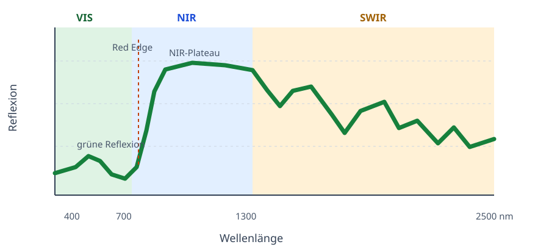

# Spektrale Signatur von Vegetation

## Die typische Reflexionskurve

Eine **spektrale Signatur** beschreibt, wie stark eine Oberfläche Licht über die
Wellenlängen hinweg reflektiert. Gesunde, grüne Vegetation zeigt häufig einen charakteristischen
Verlauf: im sichtbaren Bereich geringe Reflexion, danach einen steilen Anstieg ins nahe
Infrarot und im kurzwelligem Infrarot weitere, stärker strukturierte Veränderungen.[^1]

Die Grafik ist eine **Schemadarstellung**, keine Messung aus unserem Datensatz. Ein echtes
Spektrum kann je nach Kultur, Entwicklungsstadium, Wasserzustand, Bodenanteil und
Aufnahmebedingungen deutlich anders aussehen. Besonders ein Hyperion-Pixel kann Vegetation
und Boden gemeinsam enthalten.

### Sichtbares Licht: die Pflanze erscheint grün

Im sichtbaren Bereich von ungefähr 400 bis 700 nm absorbiert Blattchlorophyll vor allem blaues
und rotes Licht. Um ungefähr 550 nm wird vergleichsweise mehr Licht reflektiert; deshalb
erscheinen viele gesunde Blätter für Menschen grün. Nahe 670 nm liegt typischerweise ein
Reflexionsminimum, das mit der Chlorophyllabsorption zusammenhängt.[^1]

Das bedeutet nicht, dass ein einzelnes grünes Band den Chlorophyllgehalt eindeutig misst.
Blattalter, Blattmenge, Boden und Atmosphäre beeinflussen das Signal ebenfalls.

### Red Edge und nahes Infrarot

Zwischen ungefähr 680 und 750 nm steigt die Reflexion oft rasch an. Dieser Übergang heißt
**Red Edge** (rote Kante). Oberhalb davon beginnt das nahe Infrarot (NIR): Dort kann eine
dichte, gesunde Vegetationsdecke viel stärker reflektieren als im sichtbaren Licht. Die
innere Struktur der Blätter trägt wesentlich zu diesem hohen NIR-Signal bei.[^1]

Wie hoch das NIR-Plateau ausfällt, hängt auch davon ab, wie viel Blattfläche ein Pixel bedeckt.
Der **Blattflächenindex** (Leaf Area Index, LAI) beschreibt dafür die gesamte Blattfläche im
Verhältnis zur Bodenfläche. Ein hoher LAI kann das Bodensignal verdecken, ist aus einem
einzelnen Band aber nicht direkt und eindeutig ableitbar.

### Kurzwelliges Infrarot

Im SWIR-Bereich ab ungefähr 1.300 nm wird der Kurvenverlauf unter anderem durch Wasser in
Blättern sowie durch trockene Pflanzenbestandteile beeinflusst. Er enthält deshalb zusätzliche
Informationen über eine Vegetationsdecke, ist aber nicht unabhängig von Atmosphäre und Boden.
Die starken atmosphärischen Wasserabsorptionsbereiche und die dazu passenden leeren Bänder
unseres Datensatzes behandeln wir im nächsten Abschnitt.

### Bedeutung für unser Projekt

Die typische Kurve liefert konkrete EDA-Fragen: Liegen die Median-Spektren unserer Klassen in
den erwarteten Bereichen, und unterscheiden sich ihre Verläufe um die Red Edge, im NIR und im
SWIR? Eine sichtbare Differenz wäre zunächst nur ein Hinweis. Erst ein sauber validierter
Vergleich zeigt, ob sie die Kulturart oder das Entwicklungsstadium tatsächlich vorhersagbar
macht.

[^1]: Knipling (1970), siehe [Quellen](quellen.md).

## Wasserabsorptionsbänder

Ein Satellit sieht die Erdoberfläche durch die Atmosphäre. Wasserdampf in der Atmosphäre
absorbiert bei bestimmten Wellenlängen einen großen Teil des Lichts. Um ungefähr 1.400 nm und
1.900 nm erreicht deshalb wenig Licht vom Boden den Sensor. Solche Bereiche heißen
**atmosphärische Wasserabsorptionsbänder**. Eine Oberflächenreflektanz dort wäre besonders
unsicher, weil die Atmosphäre stärker zum gemessenen Signal beiträgt als die Fläche selbst.[^2]

Das ist etwas anderes als Wasser in einem Blatt: Blattwasser beeinflusst das Spektrum der
Pflanze, während atmosphärischer Wasserdampf den Lichtweg zwischen Sonne, Oberfläche und
Satellit verändert. Beide Effekte betreffen ähnliche Wellenlängenbereiche, haben aber
unterschiedliche Ursachen.

### Die leeren Bänder in unserem Datensatz

In Train und Test sind dieselben 67 von 198 Bandspalten vollständig leer. Zwei größere Gruppen
liegen an den erwarteten Wasserabsorptionsbereichen:

| Leere Bandspalten | Anzahl | Einordnung |
| --- | ---: | --- |
| `X1326`–`X1508` | 19 | Bereich um 1.400 nm |
| `X1770`–`X2052` | 29 | Bereich um 1.900 nm |
| `X427` | 1 | Spektralrand, keine Wasserabsorption ableitbar |
| `X925`–`X973` | 6 | Ursache ohne technische Dokumentation offen |
| `X1104`–`X1165` | 7 | Ursache ohne technische Dokumentation offen |
| `X2355`–`X2395` | 5 | Spektralrand, keine Wasserabsorption ableitbar |

Die beiden großen Gruppen **passen** zu atmosphärischen Wasserabsorptionsbereichen. Sie
beweisen jedoch nicht, dass dies der konkrete Grund für die fehlenden Werte ist. Auch eine
vorherige Bandauswahl, die Kalibrierung oder die Datenaufbereitung kann zu leeren Spalten
geführt haben. Insbesondere die 13 leeren Bänder um `X925`–`X973` und `X1104`–`X1165`
lassen sich ohne Hyperion- oder Datensatzdokumentation nicht als Wasserabsorption erklären.

### Konsequenz für die Datenvorbereitung

Eine vollständig leere Spalte enthält keine Messinformation. Sie kann daher später nicht
sinnvoll als Eingabemerkmal verwendet und auch nicht aus ihren eigenen Werten imputiert
werden. Die entsprechenden Spalten sind ein klarer Kandidat zum Entfernen. Die konkrete
Entfernung gehört dennoch in eine Vorverarbeitungspipeline, die ihre Entscheidung ausschließlich
auf dem Trainingsanteil trifft.

Benachbarte Bänder können für eine Explorationsgrafik hilfreich sein, ersetzen aber keine
fehlende Messung. Wir erzeugen deshalb nicht nachträglich synthetische Reflektanzwerte für
die 67 komplett leeren Bänder.

[^2]: U.S. Geological Survey (o. J.), siehe [Quellen](quellen.md).

## Veränderung über die Saison

Das Spektrum einer Kultur bleibt während der Saison nicht gleich. Entscheidend ist, welcher
Teil des Pixels die Reflexion prägt: sichtbarer Boden, grüne Blätter, alternde Blätter oder
Erntereste. Die folgende Abfolge beschreibt eine allgemeine Erwartung für einjährige Kulturen,
nicht die bestätigte Bedeutung unserer sechs `Stage`-Labels.

### Früher Bestand: Boden ist noch sichtbar

Nach dem Auflaufen bedecken wenige kleine Pflanzen nur einen Teil des Bodens. Das Spektrum
mischt daher häufig Boden- und Vegetationssignal. Wie stark die Reflexion im sichtbaren Licht,
NIR oder SWIR ausfällt, hängt dann auch von Bodenfeuchte, Bodenfarbe und Ernteresten ab.
Ein junges Feld hat deshalb nicht einfach „niedrige Vegetationswerte“, sondern oft ein stärker
gemischtes Signal.

### Grüner, dichter Bestand: Blätter prägen das Pixel

Mit zunehmender Blattfläche verdecken die Pflanzen den Boden. Bei einem grünen Bestand ist
typischerweise die Chlorophyllabsorption im roten Bereich stärker sichtbar und die Reflexion
im NIR höher als bei einem Boden-Vegetations-Mix.[^3] Blattfläche, Blattstruktur und die
Anordnung der Blätter verändern dabei gemeinsam das Signal; ein einzelner Spektralbereich
liefert keine vollständige Erklärung.

### Reife und Seneszenz: Blätter altern

Während der **Seneszenz** altern Blätter, und ihre photosynthetische Aktivität nimmt ab.
Dadurch kann die Chlorophyllabsorption im sichtbaren Bereich schwächer werden. Gleichzeitig
können Veränderungen von Blattstruktur und Wassergehalt das NIR- und SWIR-Signal beeinflussen.
Richtung und Größe der Änderung sind zwischen Kulturen, Sorten und Aufnahmebedingungen nicht
identisch.[^3]

### Nach der Ernte: Boden und Erntereste

Nach einer Ernte hängt das Spektrum vor allem von offenem Boden, zurückbleibenden Stängeln und
Blättern sowie einer möglichen Folgekultur ab. Ein Erntetermin erzeugt daher kein einheitliches
„Erntespektrum“. Ohne Angaben zur Bewirtschaftung und zur räumlichen Einheit der Beobachtung
ist nicht bekannt, wie stark dieser Effekt in unserem Datensatz vorkommt.

### Welche Bereiche könnten Stadien unterscheiden?

Aus diesen Erwartungen folgen drei prüfbare Hypothesen für die EDA:

- **Rotes Licht und Red Edge** könnten Unterschiede im Chlorophyll und damit zwischen grünem
  Bestand und Seneszenz sichtbar machen.
- **NIR** könnte auf Unterschiede der Blattfläche, Bodenbedeckung und Blattstruktur reagieren.
- **SWIR** könnte Unterschiede im Wasserzustand und in trockenen Pflanzenbestandteilen
  enthalten. Die leeren Wasserabsorptionsbänder schließen wir dabei aus.

Diese Bereiche sind keine vorab ausgewählten Modellmerkmale. Wir vergleichen zuerst für jede
Kultur die Spektren der beobachteten `Stage`-Kategorien samt Streuung. Erst danach kann ein
validierter Modellversuch zeigen, ob ein Unterschied für die Stadiumsvorhersage nützlich ist.

[^3]: Knipling (1970); Allen et al. (1998), siehe [Quellen](quellen.md).

## Vegetationsindizes

Ein **Vegetationsindex** verdichtet mehrere Reflektanzwerte zu einer Zahl. Statt die absolute
Helligkeit eines Bandes zu betrachten, nutzen viele Indizes ein Verhältnis oder eine Differenz
zwischen zwei Bereichen. Das kann Änderungen durch gleichmäßige Aufhellung oder Abdunklung
teilweise abschwächen und hebt gezielt eine spektrale Eigenschaft hervor. Es entfernt aber
weder Boden- noch Atmosphäreneinflüsse vollständig.

In den Formeln steht $R_{\lambda}$ für die Reflektanz bei der Wellenlänge $\lambda$. Da unsere
Werte als Prozentwerte vorliegen, müssen sie für Formeln mit festen Konstanten wie EVI zuerst
in Reflektanzanteile von 0 bis 1 umgerechnet werden. Die hier genannten Bänder sind die
nächstgelegenen verfügbaren Hyperion-Bänder; sie sind keine bereits getroffene
Feature-Engineering-Entscheidung.

### Indizes für grüne Vegetation

**NDVI** (Normalized Difference Vegetation Index) vergleicht NIR mit rotem Licht:

$$
\mathrm{NDVI} = \frac{R_{\mathrm{NIR}} - R_{\mathrm{red}}}
{R_{\mathrm{NIR}} + R_{\mathrm{red}}}
$$

Für unsere Daten wären `X854` als NIR und `X671` als Rot eine naheliegende Annäherung. Ein
hoher NDVI ist häufig mit grüner Vegetation verbunden, kann aber bei dichtem Bestand sättigen:
Zusätzliche Blattfläche verändert ihn dann nur noch wenig.[^4]

**EVI** (Enhanced Vegetation Index) ergänzt blaues Licht, um bestimmte Boden- und
Atmosphäreneinflüsse robuster zu behandeln:

$$
\mathrm{EVI} = 2{,}5 \cdot \frac{R_{\mathrm{NIR}} - R_{\mathrm{red}}}
{R_{\mathrm{NIR}} + 6R_{\mathrm{red}} - 7{,}5R_{\mathrm{blue}} + 1}
$$

Als Bandnäherungen kommen `X854` (NIR), `X671` (Rot) und `X468` (Blau) infrage. Die festen
Zahlen in der Formel setzen Reflektanzanteile voraus, nicht Prozentwerte.[^5]

**NDRE** (Normalized Difference Red Edge) ersetzt das rote Band durch ein Band an der Red
Edge:

$$
\mathrm{NDRE} = \frac{R_{\mathrm{NIR}} - R_{\mathrm{red\ edge}}}
{R_{\mathrm{NIR}} + R_{\mathrm{red\ edge}}}
$$

Eine passende Annäherung ist `X854` und `X702`. Die **Red-Edge-Position** ist kein einzelner
Index, sondern versucht die Lage des steilen Anstiegs zwischen Rot und NIR aus mehreren
schmalen Bändern zu bestimmen. Dafür sind die dicht aufeinanderfolgenden Hyperion-Bänder
besonders interessant.

### Indizes für Photosynthese, Wasser und trockene Bestandteile

**PRI** (Photochemical Reflectance Index) nutzt zwei schmale sichtbare Bänder:

$$
\mathrm{PRI} = \frac{R_{531} - R_{570}}{R_{531} + R_{570}}
$$

Die verfügbaren Nährungen sind `X529` und `X569`. PRI wurde für Änderungen der
photosynthetischen Lichtnutzung entwickelt. In Satellitenpixeln können jedoch Blattfläche,
Blickgeometrie und Bodenanteil die Interpretation erschweren.[^6]

**NDWI** und **NDII** bezeichnen je nach Quelle ähnliche normalisierte Differenzen aus NIR und
SWIR. Beide werden als Hinweise auf Wasser in einer Vegetationsdecke verwendet. Eine mögliche
NDWI-Variante nach Gao verwendet ungefähr 860 und 1.240 nm; hierfür passen `X854` und `X1235`:

$$
\mathrm{NDWI} = \frac{R_{854} - R_{1235}}{R_{854} + R_{1235}}
$$

Eine NDII-Variante kann statt 1.240 nm ein längeres SWIR-Band verwenden, beispielsweise
`X1639`. Vor einem Vergleich müssen wir deshalb Formel und Namenskonvention ausdrücklich
festlegen, statt NDWI und NDII als austauschbare Merkmale zu behandeln.[^7]

**CAI** (Cellulose Absorption Index) zielt auf die Absorption trockener Pflanzenbestandteile
um 2.100 nm. Die Standardformel lautet:

$$
\mathrm{CAI} = \frac{R_{2000} + R_{2200}}{2} - R_{2100}
$$

Zwar liegen `X2103` und `X2204` nahe an zwei benötigten Wellenlängen, das nächstgelegene
Band `X2002` ist jedoch vollständig leer. Der Standard-CAI ist mit diesem Datensatz daher
nicht direkt berechenbar. Eine abgewandelte Formel wäre eine eigene, später zu validierende
Feature-Engineering-Hypothese.[^8]

### Schmalband-Hyperspektralindizes

**Schmalband-Hyperspektralindizes** sind kein einzelner festgelegter Index. Sie nutzen die
vielen eng beieinanderliegenden Bänder eines hyperspektralen Sensors, etwa als spezifische
Red-Edge- oder SWIR-Verhältnisse. Das ist eine Chance von Hyperion gegenüber Sensoren mit nur
wenigen breiten Bändern, erhöht aber auch das Risiko, zufällig passende Verhältnisse zu finden.

### Bedeutung für unser Projekt

Die Kickoff-Folien nennen Vegetationsindizes ausdrücklich als Möglichkeit für Feature
Engineering und spätere Inputreduktion.[^9] Sie erzeugen keine neue Messinformation: NDVI
oder NDRE werden vollständig aus vorhandenen Bandwerten berechnet. Sie können die für eine
Frage relevante Information jedoch kompakt zusammenfassen und einem Modell damit eine
nützliche Darstellung anbieten.

Für dieses Projekt sind NDVI, EVI, NDRE, PRI und eine klar definierte Wasserindex-Variante
sinnvolle Kandidaten. Für einen späteren Vergleich stellen wir drei Merkmalsmengen gegenüber:

- die verfügbaren Rohbänder als Referenz,
- Rohbänder ergänzt um vorab festgelegte Indizes und
- eine kleine, nur aus Indizes bestehende Merkmalsmenge als Kandidat für Datenreduktion.

Das beantwortet zwei getrennte Fragen: Verbessern Indizes die Klassifikation zusätzlich zu
den Rohbändern? Und wie viel Leistung bleibt erhalten, wenn ein Modell nur wenige verdichtete
Merkmale erhält? Beide Fragen gelten getrennt für `Crop` und `Stage`. Ein gutes Ergebnis bei
der Kulturart ist kein Beleg dafür, dass derselbe Index auch Entwicklungsstadien trennt.

Die Formeln und ihre Bänder werden vor der Auswertung festgelegt. Auswahl, Vergleich und
gegebenenfalls weitere schmalbandige Varianten erfolgen ausschließlich mit Training und
Cross-Validation; das ungelabelte Testset darf diese Entscheidungen nicht beeinflussen. Die
Berechnung gehört in die Pipeline. Ob ein Kandidat nützt, entscheiden Balanced Accuracy,
Macro-F1 und Samples-F1 auf der davon getrennten Validierung.[^9]

[^4]: Tucker (1979), siehe [Quellen](quellen.md).
[^5]: Huete et al. (2002), siehe [Quellen](quellen.md).
[^6]: Gamon, Peñuelas & Field (1992), siehe [Quellen](quellen.md).
[^7]: Gao (1996), siehe [Quellen](quellen.md).
[^8]: Daughtry, Hunt & McMurtrey (2004), siehe [Quellen](quellen.md).
[^9]: Domänenprojekt 2 (2026), siehe [Quellen](quellen.md).
