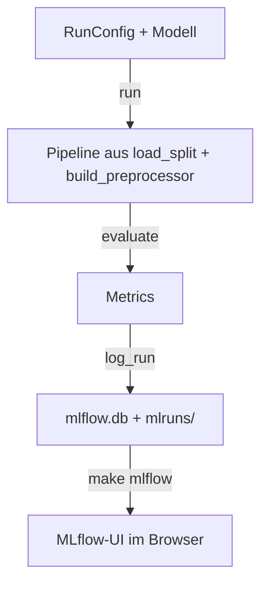

# Experimente & MLflow

Wir probieren viele Modelle und Einstellungen aus. Damit Ergebnisse nicht in Notebooks oder im
Kopf verloren gehen, zeichnet **MLflow** jeden Lauf automatisch auf – mit Einstellungen, Scores,
Plots und dem Code-Stand – und stellt alle Läufe in einer Oberfläche zum Vergleichen dar.

## Was nimmt uns MLflow ab?

| Ohne MLflow | Mit MLflow |
| --- | --- |
| Scores von Hand in Tabellen kopieren | Jeder Lauf mit `run()` wird automatisch gespeichert |
| „Welche Einstellungen hatte der gute Lauf von gestern?“ | Alle Parameter liegen beim Lauf |
| „Mit welchem Code- und Datenstand war das?“ | Git-Commit, Branch, Autor:in und Datenversion als Tags; `git.dirty` zeigt uncommittete Änderungen in `src/` oder `notebooks/` |
| Plots suchen oder neu erzeugen | Confusion Matrices hängen am Lauf |
| Modell neu trainieren, um es wieder zu nutzen | Mit `log_model=True` gespeichert und jederzeit ladbar |
| Läufe mühsam nebeneinanderlegen | UI: Läufe anhaken → **Compare** |

## Begriffe

| Begriff | Bei uns |
| --- | --- |
| **Experiment** | Sammelmappe für Läufe – wir haben eine: `awp2` |
| **Run** (Lauf) | Ein Aufruf von `run()` mit Namen, z. B. `rf_baseline` |
| **Parameter** | Einstellungen: `preprocessing.scale`, `balance_samples`, `model.max_depth` … – bei verschachtelten Modellen mit sklearn-Namen, z. B. `model.estimator__max_depth` |
| **Metrik** | Scores aus `evaluate()`: `bacc_combined`, `bacc_crop`, `f1_samples` … |
| **Tag** | Zusatzinfos: `git.commit`, `git.branch`, `git.dirty`, `author`, `data.version` (Hash von Datensatz + Split) |
| **Artefakt** | Dateien am Lauf: `confusion_matrices.png`, optional das Modell |
| **Tracking-Store** | Datenbank mit Runs, Parametern, Metriken: `mlflow.db` im Projekt-Root |
| **Artefakt-Store** | Ordner für Dateien: `mlruns/` im Projekt-Root |

Beides ist **gitignored** und liegt nur lokal auf deinem Rechner.

## Wie es bei uns funktioniert



`run()` trainiert auf dem gemeinsamen Train-Split, bewertet auf der Validierung und ruft dann
`awp2.tracking.log_run()` auf. Nur dieses eine Modul spricht mit MLflow – ein Wechsel des
Tools oder auf einen gemeinsamen Server betrifft nur diese Datei.

## So nutzt du es

### Ein Modell ausprobieren

```python
from sklearn.ensemble import RandomForestClassifier

from awp2.config import SEED
from awp2.experiment import RunConfig, run
from awp2.preprocessing import PreprocessingConfig

result = run(
    RandomForestClassifier(class_weight="balanced", random_state=SEED),
    RunConfig(name="rf_baseline", preprocessing=PreprocessingConfig(use_meta=True)),
)
result.metrics.bacc_combined   # Score
result.run_id                  # Lauf in MLflow
```

| Option in `RunConfig` | Wirkung |
| --- | --- |
| `name` | Name des Laufs, klein und ohne Leerzeichen |
| `preprocessing` | Optionen der Vorverarbeitung, siehe [Pipeline](../daten/pipeline.md) |
| `balance_samples=True` | Ausgleichsgewichte für Modelle ohne `class_weight` |
| `track=False` | Schneller Test, der nicht gespeichert wird |
| `log_model=True` | Modell mitspeichern – für Läufe, die man weiterverwenden will (dauert einige Sekunden länger und zeigt eine Hinweis-Warnung zum Speicherformat) |

Das Modell muss **Crop und Stage** vorhersagen – wie, entscheidet der [Ansatz](../modelle/ansaetze.md).

### Läufe vergleichen

```bash
make mlflow   # http://127.0.0.1:5000
```

Experiment **awp2** öffnen → nach `bacc_combined` sortieren → interessante Läufe anhaken →
**Compare** zeigt Parameter und Metriken nebeneinander. Im Lauf liegt unter *Artifacts* die
Confusion Matrix; gespeicherte Modelle erscheinen im Tab *Logged models*. Nur Läufe mit gleicher
`data.version` sind direkt vergleichbar.

!!! warning "Nicht auf der Validierung tunen"
    `run()` bewertet auf dem 30-%-Holdout – er ist für den Vergleich **fertiger** Ansätze da.
    Wer viele `run()`-Aufrufe mit verschiedenen Hyperparametern startet und den besten nimmt,
    tuned auf dem Holdout und überschätzt den Score. Hyperparameter per Cross-Validation mit
    `load_folds()` wählen ([Pipeline → Tunen](../daten/pipeline.md#3-tunen)), dann das Ergebnis
    einmal mit `run()` bewerten.

### Ein gespeichertes Modell wieder laden

```python
import mlflow.sklearn

from awp2.config import MLFLOW_TRACKING_URI
from awp2.data import load_test

mlflow.set_tracking_uri(MLFLOW_TRACKING_URI)
model = mlflow.sklearn.load_model("runs:/<run_id>/model")
model.predict(load_test())
```

### Ergebnisse ins Team bringen

Jede:r sieht in MLflow nur die **eigenen** Läufe. Was das Team kennen soll, kommt als Zeile ins
[Experiment-Log](../modelle/experimente.md) – mit den ersten 8 Zeichen der Run-ID, damit sich der
Lauf wiederfinden lässt. Vorher committen, damit `git.dirty` nicht `True` ist.

### Neu anfangen

`mlflow.db` und `mlruns/` löschen – beim nächsten `run()` entsteht ein leerer Store.

## Was wir bewusst nicht nutzen

| MLflow-Funktion | Warum nicht |
| --- | --- |
| Tracking-Server | Kein Betrieb eines Dienstes nötig; Teamvergleich über das Experiment-Log |
| Model Registry | Wir liefern am Ende eine Vorhersage-CSV, kein Modell in Produktion |
| Autologging | Loggt sehr viel Unwichtiges; wir loggen gezielt, was wir vergleichen |
| Tracing | Für LLM-Anwendungen gedacht, nicht für unsere Modelle |

## Entscheidung: MLflow lokal (#47)

| Tool | Stärken | Schwächen |
| --- | --- | --- |
| **MLflow lokal** ✅ | Verbreitet, Open Source, UI zum Vergleichen, kein externer Dienst | Läufe nur lokal sichtbar |
| MLflow + DagsHub | Gemeinsamer gehosteter Server | Externer Dienst, Accounts |
| Weights & Biases | Sehr gute Team-Dashboards | Cloud-Dienst, Account je Person |
| DVC Experiments | Läufe in git, kein Server | Mehr Konzepte, schwächere UI |
| Nur Markdown-Log | Kein Tool | Kein interaktiver Vergleich |

Wir wollten MLflow als verbreitetes Werkzeug kennenlernen und keinen externen Dienst einbinden.
Der Nachteil – keine gemeinsame Ansicht – gleicht das Experiment-Log im Repo aus. Soll es später
doch ein gemeinsamer Server sein, reicht `MLFLOW_TRACKING_URI` zu setzen.
