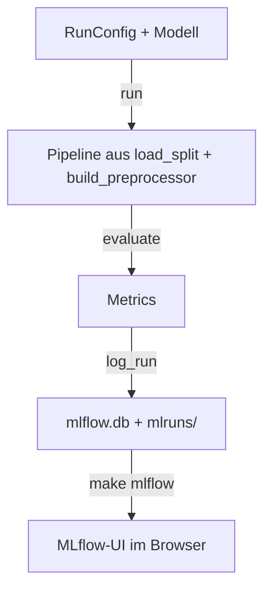

# Experimente ausführen

So trainierst und bewertest du Modelle mit `run()` und vergleichst die Läufe in MLflow. Was
MLflow ist und warum wir es nutzen: [MLflow – Überblick](mlflow.md).

## Wie es bei uns funktioniert



`run()` trainiert auf dem gemeinsamen Train-Split, bewertet auf der Validierung und ruft dann
`awp2.tracking.log_run()` auf. Nur dieses eine Modul spricht mit MLflow – ein Wechsel des
Tools oder auf einen gemeinsamen Server betrifft nur diese Datei.

## So nutzt du es

### Ein Modell ausprobieren

```python
from sklearn.ensemble import RandomForestClassifier

from awp2.config import SEED
from awp2.experiment import RunConfig, run
from awp2.preprocessing import PreprocessingConfig

result = run(
    RandomForestClassifier(class_weight="balanced", random_state=SEED),
    RunConfig(
        name="rf_baseline",
        approach="baseline",
        description="Random Forest auf allen Bändern als erste Referenz.",
        preprocessing=PreprocessingConfig(use_meta=True),
    ),
)
result.metrics.bacc_combined   # Score
result.run_id                  # Lauf in MLflow
result.model_uri               # gespeichertes Modell, z. B. für Vorhersagen
```

| Option in `RunConfig` | Standard | Wirkung |
| --- | --- | --- |
| `name` | – | Name des Laufs, klein und ohne Leerzeichen |
| `approach` | – | Ansatz, zu dem der Lauf gehört, z. B. `baseline`, `hierarchical` – zum Filtern und Gruppieren |
| `description` | leer | Was probiert wurde und warum – erscheint als Beschreibung des Laufs |
| `experiment` | `crop-stage` | Nur für andere Fragen ändern, z. B. `band-reduction` für die Studie in M3 |
| `preprocessing` | Standard | Optionen der Vorverarbeitung, siehe [Pipeline](../daten/pipeline.md) |
| `balance_samples` | `False` | Ausgleichsgewichte für Modelle ohne `class_weight` |
| `log_model` | `True` | Modell speichern (Tab *Models*); für schnelle Tests `False` |
| `system_metrics` | `False` | CPU-/Speicherverlauf aufzeichnen – lohnt sich bei längeren Trainings |
| `track` | `True` | `False` = gar nichts speichern |

Das Modell muss **Crop und Stage** vorhersagen – wie, entscheidet der [Ansatz](../modelle/ansaetze.md).

### Läufe vergleichen

```bash
make mlflow   # http://127.0.0.1:5000
```

Oben links auf **Model training** umschalten (einmalig, siehe [Überblick → Oberfläche](mlflow.md#die-oberflache)),
Experiment **crop-stage** öffnen → nach `bacc_combined` sortieren oder mit *Group by* nach
`approach` gruppieren → Läufe anhaken → **Compare** zeigt Parameter und Metriken nebeneinander.
Im Lauf liegt unter *Artifacts* die Confusion Matrix; alle Modelle stehen im Tab *Models*.
Direkt vergleichbar sind nur Läufe mit gleichem Dataset-Hash (Spalte *Dataset*).

!!! warning "Nicht auf der Validierung tunen"
    `run()` bewertet auf dem 30-%-Holdout – er ist für den Vergleich **fertiger** Ansätze da.
    Wer viele `run()`-Aufrufe mit verschiedenen Hyperparametern startet und den besten nimmt,
    tuned auf dem Holdout und überschätzt den Score. Hyperparameter per Cross-Validation mit
    `load_folds()` wählen ([Pipeline → Tunen](../daten/pipeline.md#3-tunen)), dann das Ergebnis
    einmal mit `run()` bewerten.

### Ein gespeichertes Modell wieder laden

```python
import mlflow.sklearn

from awp2.config import MLFLOW_TRACKING_URI
from awp2.data import load_test

mlflow.set_tracking_uri(MLFLOW_TRACKING_URI)
model = mlflow.sklearn.load_model(result.model_uri)   # oder "models:/<Model-ID>" aus dem Tab Models
model.predict(load_test())
```

### Ergebnisse ins Team bringen

Jede:r sieht in MLflow nur die **eigenen** Läufe. Was das Team kennen soll, kommt als Zeile ins
[Experiment-Log](../modelle/experimente.md) – mit den ersten 8 Zeichen der Run-ID, damit sich der
Lauf wiederfinden lässt. Vorher committen, damit `git.dirty` nicht `True` ist.

### Neu anfangen

`mlflow.db` und `mlruns/` löschen – beim nächsten `run()` entsteht ein leerer Store.

## Schnelltest: funktioniert alles?

Einmal nach dem Einrichten oder wenn du unsicher bist:

```bash
make data            # falls data/interim und data/processed noch fehlen
uv run python -c "
from sklearn.dummy import DummyClassifier
from awp2.experiment import RunConfig, run
r = run(DummyClassifier(), RunConfig(name='smoke_test', approach='baseline', description='Schnelltest'))
print(r.metrics.bacc_crop, r.run_id)
"
make mlflow          # http://127.0.0.1:5000
```

Erwartet: `0.2` (Zufallsniveau bei 5 Kulturen) und eine Run-ID. In der Oberfläche (auf
**Model training** umschalten) im Experiment **crop-stage**:

- [ ] Lauf `smoke_test` mit Datasets `training` und `validation` in der Liste
- [ ] *Overview*: Beschreibung „Schnelltest“, Parameter, 8 Metriken, Tag `approach = baseline`
- [ ] *Artifacts*: `confusion_matrices.png`
- [ ] Tab *Models*: Modell `smoke_test` mit seinen Metriken

Den Testlauf danach löschen (Lauf anhaken → *Delete*).
