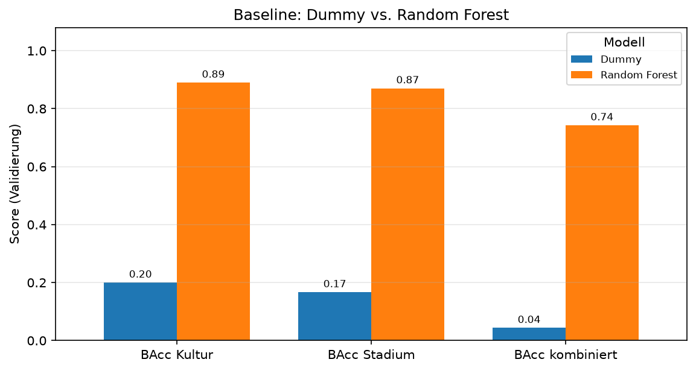
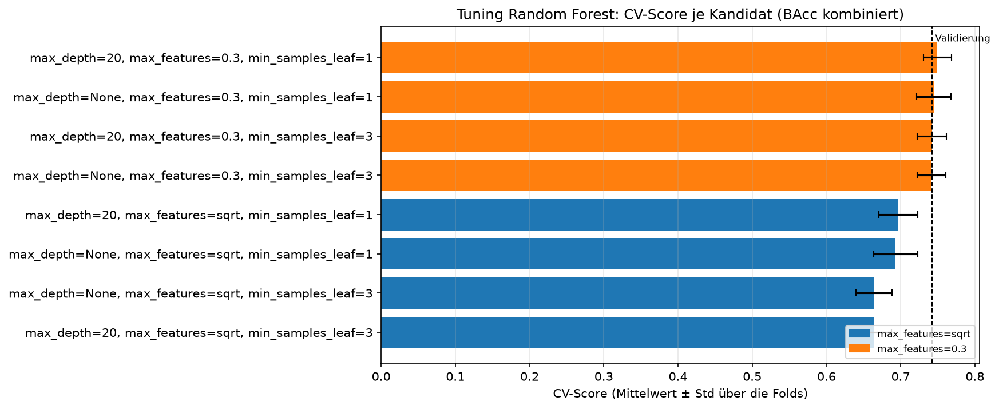
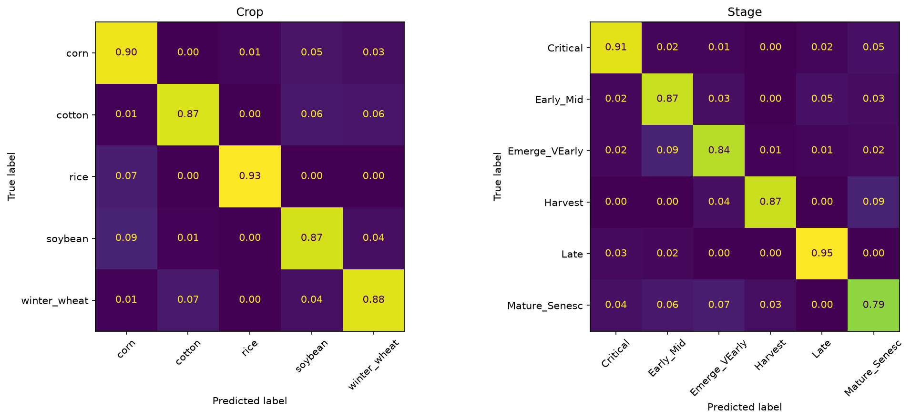
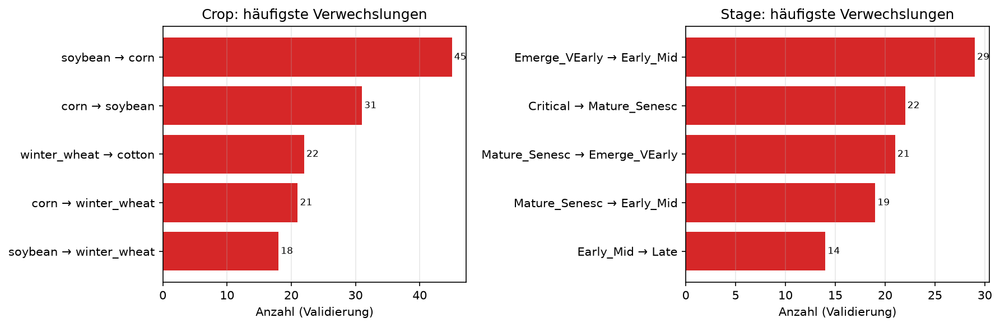
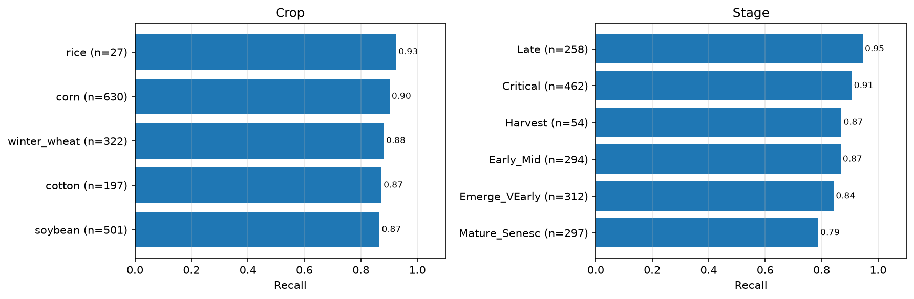

# Baseline

## Idee

Referenzwerte für M1 (#27) – bewusst **kein** begründeter Ansatz, sondern die Messlatte für
alle weiteren: eine Untergrenze ohne Lernen und ein einfaches Modell, das Crop und Stage ohne
eigene Logik gemeinsam vorhersagt. Notebook: `notebooks/01_jd_baseline.ipynb`.

| Klassifikator | BAcc Crop | BAcc Stage | BAcc kombiniert | Samples-F1 | MLflow-Run |
| --- | --- | --- | --- | --- | --- |
| [Dummy](#dummy) | 0.200 | 0.167 | 0.044 | 0.326 | `f8cf4ecc` |
| [Random Forest](#random-forest) | 0.890 | 0.870 | **0.743** | 0.878 | `9641f6a8` |

## Klassifikatoren

### Dummy

Sagt immer die häufigste Kultur und das häufigste Stadium vorher (`strategy="most_frequent"`).

- Liegt genau auf Zufallsniveau der Balanced Accuracy (1/5 Kulturen, 1/6 Stadien) – jeder
  ernsthafte Klassifikator muss deutlich darüber liegen.

### Random Forest

300 Bäume, `class_weight="balanced"`, sagt Crop und Stage nativ gemeinsam vorher; Standard-
Vorverarbeitung mit AEZ/Month. Per `tune()` gesucht (8 Kandidaten, Lauf `rf_search`):
beste Einstellung `max_depth=20`, `max_features=0.3`, `min_samples_leaf=1` – CV-Score
0.750 ± 0.019, Validierung 0.743.

#### Mehr Bänder pro Entscheidung helfen – und die CV schätzt ehrlich

- `max_features=0.3` schlägt `sqrt` deutlich (0.75 vs. 0.66–0.70): Pro Split mehr Bänder zu
  sehen hilft – die Information steckt in vielen, stark korrelierten Bändern.
- Der Validierungs-Score (gestrichelt) liegt im Streubereich der CV → keine Überanpassung an den
  Holdout.

#### Verwechselt werden Mais ↔ Soja und benachbarte Stadien

- Kultur: häufigste Verwechslung **Mais ↔ Soja** (45 bzw. 31 Fälle) – beides Sommerkulturen mit
  ähnlicher Saison; außerdem Winterweizen → Baumwolle.
- Stadium: vor allem **benachbarte Stadien** (Emerge_VEarly → Early_Mid, Critical →
  Mature_Senesc) – und Mature_Senesc → Emerge_VEarly: Beide zeigen wenig grüne Vegetation und
  viel Boden, spektral also ähnlich trotz entgegengesetzter Saisonphase.

#### Am schwächsten: Mature_Senesc

- Die Kulturen liegen nah beieinander (Recall 0.87–0.93); beim Stadium fällt Mature_Senesc ab
  (0.79).
- 0,3 % der Vorhersagen sind unmögliche Kultur/Stadium-Paare – der Random Forest kennt die
  Abhängigkeit nicht.

## Fazit

**Verglichen – Referenz.** Jeder weitere Ansatz muss BAcc kombiniert **0.743** schlagen. Die
unmöglichen Paare und die Verwechslung benachbarter Stadien sprechen dafür, die Abhängigkeit
zwischen Kultur und Stadium auszunutzen ([Hierarchisch](hierarchisch.md),
[Kombinierte Klasse](kombiniert.md)).
