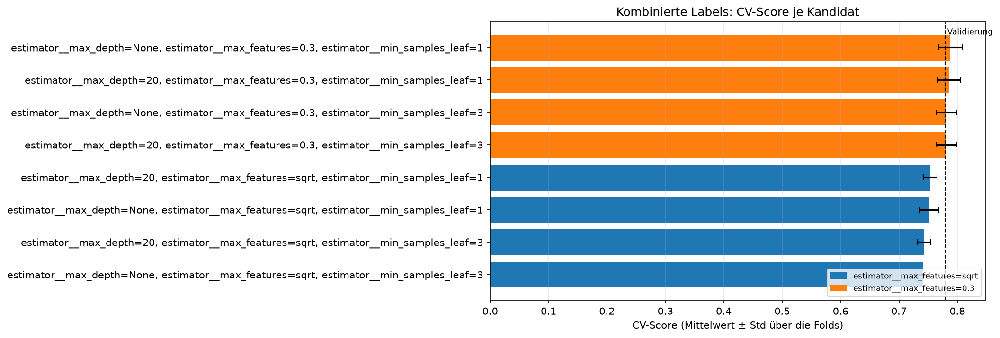
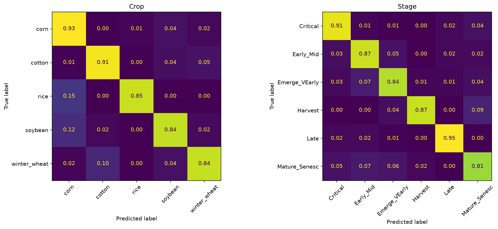
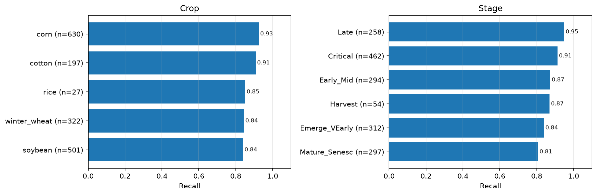
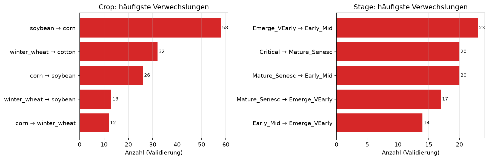
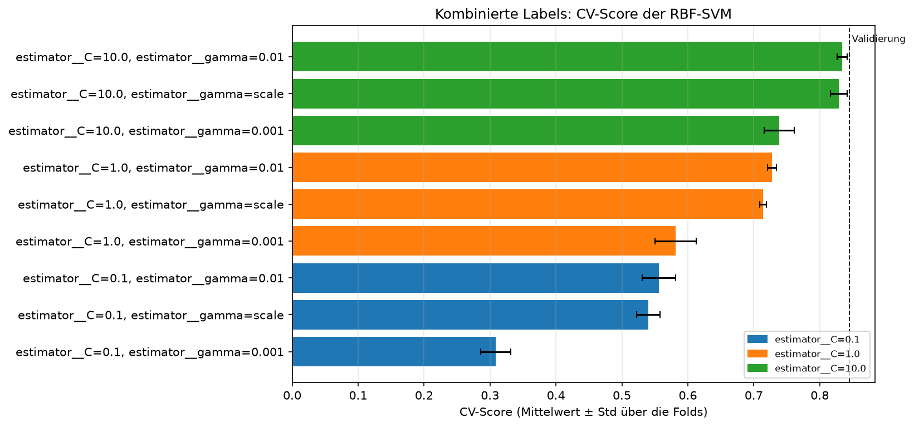
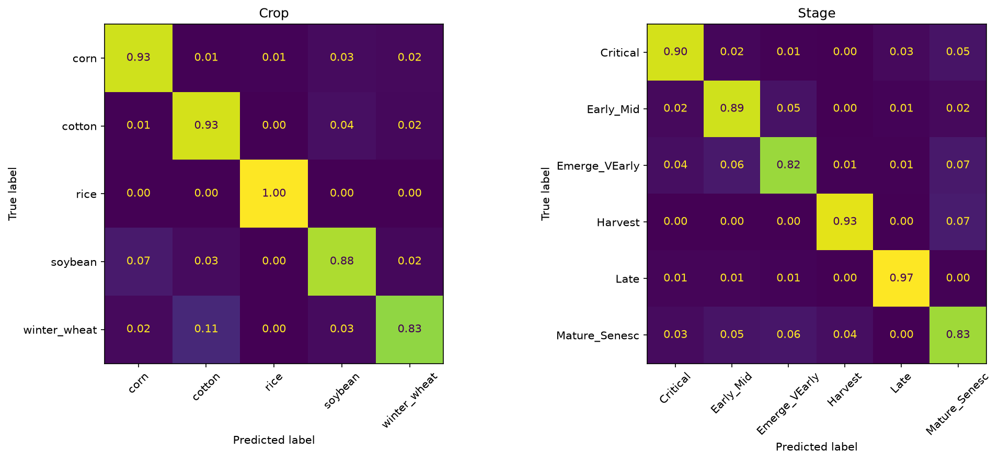
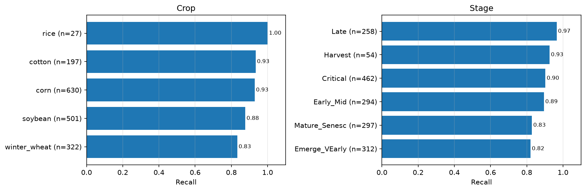
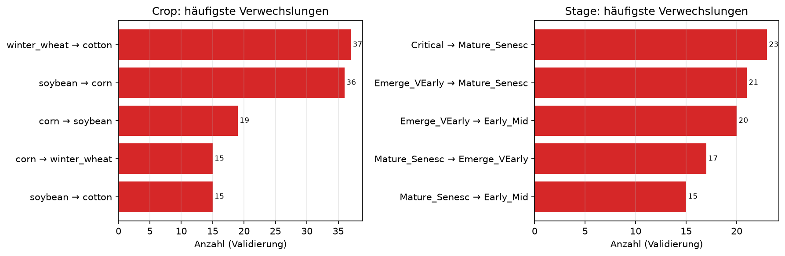
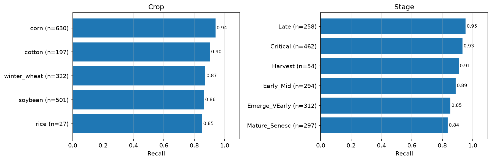
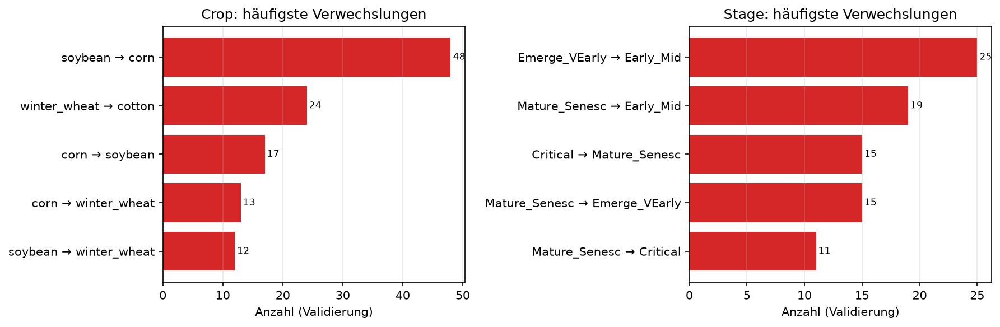

# Kombinierte Klasse

## Idee

Kultur und Stadium werden zu *einer* Klasse `Crop|Stage` verbunden – 23 Klassen im Datensatz.
Ein beliebiger Klassifikator lernt damit direkt die gemeinsame Verteilung P(Crop, Stage).
Baustein und Recherche: #54, Entwurf #55.

## Vor- und Nachteile

| Vorteil | Nachteil |
| --- | --- |
| Sagt nur Paare vorher, die es gibt | Nutzt nicht, dass das Stadium von der Kultur abhängt: P(Crop, Stage) = P(Crop) · P(Stage \| Crop) wird als 23 unabhängige Klassen gelernt |
| Funktioniert mit jedem Klassifikator | Kein geteiltes Wissen zwischen z. B. Mais/Late und Soja/Late |
| Ein Modell, einfach zu vergleichen | Wenige Daten je Klasse (Baumwolle/Harvest: 11 Zeilen) |
| | Jeder Kultur-Fehler ist automatisch auch ein Stadium-Fehler |

## Arbeitsplan für M2

Ziel ist nicht, möglichst viele Modelle auszuprobieren, sondern die derzeit beste Referenz
`combined_svm` (BAcc kombiniert 0.845) mit wenigen, unterscheidbaren Hypothesen zu prüfen.
Jede Zeile ist ein eigenes Experiment: Die Entscheidung über Hyperparameter erfolgt nur anhand
der CV auf dem Trainingsanteil; die Validierung wird danach genau einmal verwendet.

| Reihenfolge | Hypothese | Klassifikator und Repräsentation | Vorverarbeitung | Entscheidung nach dem Lauf |
| --- | --- | --- | --- | --- |
| 0 | Die bestehende Referenz ist reproduzierbar. | RBF-SVM, tabellarisch | Spektren interpolieren, `scale=True`, Metadaten an | Scores und Run in MLflow mit der Dokumentation abgleichen. |
| 1 | Eine andere Baumaufteilung nutzt die Bandmerkmale besser als Random Forest. | Extra Trees, tabellarisch | `scale=False`, Metadaten an, ausgewogene Klassen | Nur weiterverfolgen, wenn die CV-BAcc kombiniert die RF-Referenz klar übertrifft. |
| 2 | Additive Splits liefern gegenüber Baum-Ensembles einen Zusatznutzen. | HistGradientBoosting, tabellarisch | `scale=False`, Metadaten an, gewichtete Samples | Gegen SVM und Extra Trees auf dem gemeinsamen Holdout einordnen. |
| 3 | Der Kontext oder Vegetationsindizes tragen eigenständige Information bei. | Bester tabellarischer Klassifikator aus 1--2 | Jeweils genau eine Ablation: `use_meta=False` oder `use_vegetation_indices=True` | Behalten, wenn die CV besser ist und die Validierung den Gewinn nicht widerlegt. |
| 4 | Lokale Muster benachbarter Wellenlängen helfen über die Tabelle hinaus. | Kleine 1D-CNN, sequenziell | Spektren skalieren; AEZ/Month getrennt als Kontextzweig oder bewusst ausschalten | Nur bauen, wenn die tabellarische Referenz und deren Ablationen dokumentiert sind. |

Die Reihenfolge ist absichtlich konservativ: Mit rund 3.900 Trainingszeilen und 23 kombinierten
Klassen ist die tabellarische RBF-SVM bereits stark. Ein sequenzielles Netz ist ein begründeter
Vergleich, aber keine Abkürzung zu besseren Ergebnissen.

### Erster Arbeitstag

1. Issue übernehmen und den Branch `exp/<issue-nr>-combined-<idee>` anlegen; fehlen die
    Artefakte, einmal `make data` ausführen.
2. `notebooks/02_duac1011_combined-svm.ipynb`, diese Seite und das
    [Experiment-Log](../experimente.md) lesen. Die aktuelle Zielmarke lautet BAcc kombiniert
    0.845, nicht nur BAcc Crop oder Stage.
3. Eine konkrete Hypothese wählen, etwa: „Extra Trees behandelt die stark korrelierten Bänder
    robuster als Random Forest.“ Dazu nur eine kleine, begründete Suche für `max_features`,
    `min_samples_leaf` und gegebenenfalls `max_depth` festlegen.
4. Den Klassifikator in `src/awp2/models/combined.py` als
    `CombinedLabelClassifier` kapseln. Dadurch kann das Modell ausschließlich vorhandene
    `Crop|Stage`-Paare vorhersagen und bleibt mit `tune()`/`run()` kompatibel.
5. Mit `tune()` auf den fünf Trainings-Folds suchen, nach `tuned.best_score` entscheiden und
    erst dann mit `run()` einmal auf der Validierung auswerten. Die Vorverarbeitung in beiden
    Aufrufen identisch über `PreprocessingConfig` angeben.
6. Metriken, ungültige Kombinationen, Confusion Matrices und die häufigsten Verwechslungen
    analysieren. Danach eine Zeile im [Experiment-Log](../experimente.md) und diesen Abschnitt
    aktualisieren; erst dann die nächste Hypothese wählen.

### Preprocessing als kontrollierte Erweiterung

Die gemeinsame Pipeline entfernt vollständig leere Bänder und interpoliert fehlende Werte
entlang der Wellenlänge bereits innerhalb jedes Trainings-Folds. Diese Schritte werden nicht
im Notebook nachgebaut. Für den kombinierten Ansatz sind die folgenden Optionen bewusst
getrennte Versuche:

| Variante | `PreprocessingConfig` | Erwartung | Besonderheit |
| --- | --- | --- | --- |
| Tabellarische SVM | `scale=True`, `use_meta=True` | Nichtlineare Grenzen auf vergleichbarer Skala | Aktuelle Referenz; Skalierung ist erforderlich. |
| Baum-Ensembles | `scale=False`, `use_meta=True` | Nichtlineare Interaktionen ohne Skalierung | Klassengewichte oder Sample Weights gegen die ungleichen kombinierten Klassen einsetzen. |
| Kontext-Ablation | `use_meta=False` | Misst den reinen Beitrag der Spektren | Nie anhand eines anderen Splits vergleichen. |
| Indizes | `use_vegetation_indices=True` | Testet NDVI, NDRE, PRI und NDWI zusätzlich zu den Bändern | Gegen dieselbe Basiskonfiguration ohne Indizes vergleichen. |
| Spätere Glättung/Bandauswahl | neues Feld in `PreprocessingConfig` und Transformer in `awp2.preprocessing` | Kann Rauschen oder Redundanz senken | Erst eine fachliche Hypothese und einen kleinen Vergleich definieren; niemals Features vor dem CV fitten. |

Month bleibt zunächst numerisch, AEZ wird One-Hot-kodiert. Eine zyklische Month-Kodierung ist
eine weitere, getrennte Preprocessing-Hypothese und darf nicht still in ein anderes Experiment
einfließen.

### Dokumentations-Checkliste je Versuch

- Notebook: Fragestellung, Daten- und Preprocessing-Konfiguration, CV-Gewinner und einmaliges
  Validierungsergebnis.
- MLflow: Tuning-Lauf mit Kandidaten und Bewertungslauf mit Verweis auf den Tuning-Lauf.
- Analyse: BAcc für Crop, Stage und kombiniert, Macro-F1 kombiniert, Samples-F1, ungültige
    Paare sowie mindestens eine begründete Beobachtung aus den Verwechslungen.
- Versionierte Doku: eine Zeile im [Experiment-Log](../experimente.md), Ergebnis und Fazit auf
  dieser Seite sowie wichtige Abbildungen in `docs/modelle/img/`.

!!! todo "Recherche (#54, Grundlagen in #11)"
    - Wird der Ansatz in der Literatur für hierarchische Labels genutzt, und mit welchem Ergebnis?
    - Wie verhält er sich gegenüber hierarchischer Klassifikation bei so seltenen Klassen?
    - Quellen in [Quellen](../../domaene/quellen.md) eintragen.

## Klassifikatoren

### Random Forest

Notebook: `notebooks/02_duac1011_mlflow-test.ipynb`. Der Random Forest lernt 23 kombinierte
Klassen und gibt seine Vorhersagen anschließend wieder als `Crop` und `Stage` aus.

- 300 Bäume, ausgewogene Klassengewichte und Standardvorverarbeitung mit AEZ/Month.
- Die Suche `combined_rf_search` (MLflow `b2cefd2`) verglich acht Konfigurationen; am besten
    war `max_depth=None`, `max_features=0.3`, `min_samples_leaf=1` mit CV-BAcc kombiniert
    0.788.
- Der einmalige Validierungslauf `combined_rf` (MLflow `5b7e6cef`) erreicht BAcc 0.874 für
    Crop, 0.876 für Stage und **0.779 kombiniert**; damit übertrifft er die Baseline um 0.036.
- Alle vorhergesagten Crop/Stage-Paare sind gültig. Schwächster Recall bleibt Mature_Senesc
    (0.81); die häufigste Kulturverwechslung ist Soja → Mais (58 Fälle).

### RBF-SVM

Notebook: `notebooks/02_duac1011_combined-svm.ipynb`. Die SVM lernt dieselben 23 kombinierten
Klassen wie der Random Forest; Spektren und Month werden dafür standardisiert.

- **Warum getestet?** Der Random Forest ist eine starke, aber stückweise aufgeteilte Referenz.
    Die RBF-SVM prüft die Gegenhypothese, dass sich die 23 Crop/Stage-Paare mit glatten,
    nichtlinearen Entscheidungsgrenzen in den stark korrelierten Spektralbändern besser trennen
    lassen. Skalierung macht Abstände zwischen Bändern und Month für den RBF-Kernel vergleichbar;
    `class_weight="balanced"` verhindert, dass häufige kombinierte Klassen die Grenze dominieren.
- Die Suche `combined_svm_search` (MLflow `9b1c0917`) verglich neun Kombinationen aus `C` und
    `gamma`. Beste Einstellung: `C=10.0`, `gamma=0.01`, CV-BAcc kombiniert 0.834.
- Der einmalige Validierungslauf `combined_svm` (MLflow `b2776f68`) erreicht BAcc 0.914 für
    Crop, 0.890 für Stage und **0.845 kombiniert**. Das übertrifft den kombinierten Random Forest
    um 0.066.
- **Warum besser?** Der Vorsprung erscheint bereits in der CV (0.834 gegenüber 0.788 für den
    Random Forest) und bleibt auf der getrennten Validierung bestehen (0.845 gegenüber 0.779).
    Das stützt die Annahme, dass die RBF-SVM die Klassenstruktur mit dieser Repräsentation besser
    erfasst. Es beweist jedoch nicht, welcher einzelne Effekt entscheidend ist: Kernel, Skalierung
    und Modellfamilie wurden gemeinsam verändert. Eine gezielte Ablation wäre nötig, um ihren
    jeweiligen Anteil zu bestimmen.
- Alle vorhergesagten Crop/Stage-Paare sind gültig. Bei Crop bleibt Winterweizen mit Recall 0.83
    am schwächsten; bei Stage sind Emerge_VEarly (0.82) und Mature_Senesc (0.83) am schwächsten.
- Die häufigsten Verwechslungen sind Winterweizen → Baumwolle (37), Soja → Mais (36) und
    Critical → Mature_Senesc (23).

### Extra Trees

Notebook: `notebooks/02_duac1011_combined-extra-trees.ipynb`. Extra Trees lernt 23
kombinierte Klassen mit zufälligeren Baumaufteilungen als der Random Forest.

- **Warum getestet?** Die zufälligeren Aufteilungen prüfen, ob sich die stark korrelierten
    Spektralbänder robuster trennen lassen als mit dem Random Forest.
- Die Suche `combined_extra_trees_search` (MLflow `915736b9`) verglich acht Konfigurationen
    aus `max_features`, `min_samples_leaf` und `max_depth`. Beste Einstellung:
    `max_features=0.3`, `min_samples_leaf=2`, `max_depth=None`, CV-BAcc kombiniert 0.812.
- Der einmalige Validierungslauf `combined_extra_trees` (MLflow `78877676`) erreicht BAcc
    0.886 für Crop, 0.895 für Stage und **0.804 kombiniert**. Das übertrifft den kombinierten
    Random Forest um 0.025, bleibt aber 0.041 hinter der RBF-SVM.
- Alle vorhergesagten Crop/Stage-Paare sind gültig. Die häufigsten kombinierten Verwechslungen
    sind Baumwolle/Emerge_VEarly → Baumwolle/Early_Mid (15) und Soja/Critical → Mais/Critical
    (14); sie deuten auf überlappende frühe Stadien und Kultursignaturen hin.

## Fazit

**Verglichen – vorläufig führend.** Die RBF-SVM verbessert die kombinierte BAcc gegenüber Random
Forest und Extra Trees deutlich und verhindert weiterhin ungültige Paare. Gegen hierarchische
und Multi-Task-Ansätze bleibt der kombinierte Ansatz weiter zu vergleichen.
