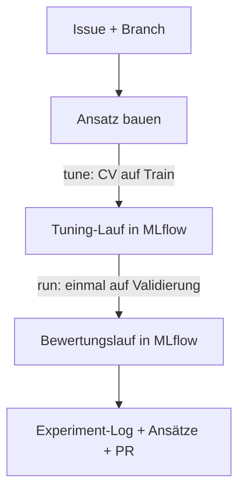

# Einen Ansatz entwickeln

Der Ablauf von der Idee bis zum Vergleich mit den anderen Ansätzen. Er stellt sicher, dass alle
Ergebnisse vergleichbar sind und sich jede Zahl im Bericht belegen lässt.



## 1. Aufgabe starten

`/start <nr>` (Issue auf *In Progress*, Branch `exp/<nr>-…`), zum Ausprobieren ein Notebook mit
`/notebook <kürzel> <thema>`. Einmalig vorher: `make data`.

## 2. Ansatz bauen

Das Modell muss **Crop und Stage** vorhersagen – wie, ist genau der Ansatz (getrennt,
kombiniert, hierarchisch …, siehe [Ansätze](ansaetze.md)). Wiederverwendbarer Code gehört nach
`src/awp2/models/<ansatz>.py`, das Notebook ruft ihn nur auf. Zusätzliche Vorverarbeitung wird
ein Feld in `PreprocessingConfig`, nicht Code im Notebook.

## 3. Hyperparameter suchen – `tune()`

```python
from sklearn.ensemble import RandomForestClassifier

from awp2.config import SEED
from awp2.experiment import TuneConfig, tune

tuned = tune(
    RandomForestClassifier(class_weight="balanced", random_state=SEED),
    TuneConfig(
        name="rf_depth",
        approach="baseline",
        description="Tiefe und Blattgröße des Random Forest",
        param_grid={"max_depth": [5, 15, None], "min_samples_leaf": [1, 5]},
    ),
)
tuned.best_params, tuned.best_score   # beste Einstellung und ihr CV-Score
```

`tune()` probiert jede Kombination per 5-facher Cross-Validation **nur auf dem Train-Teil**
aus. In MLflow entsteht ein **Tuning-Lauf** mit einem **Unterlauf je Kandidat** – so ist später
sichtbar, was ausprobiert wurde und wie knapp die Entscheidung war.

## 4. Einmal bewerten – `run()`

```python
from awp2.experiment import RunConfig, run

result = run(
    tuned.best_model,
    RunConfig(
        name="rf_tuned",
        approach="baseline",
        description="Bester Random Forest aus rf_depth",
        tuning_run=tuned.run_id,
    ),
)
result.metrics.bacc_combined
```

`run()` trainiert die gefundene Einstellung auf dem ganzen Train-Teil und bewertet sie **einmal**
auf der Validierung (30 %). Das ist die Zahl, die zählt. Der Bewertungslauf verweist über
`tuning_run` auf die Suche und speichert das Modell (`result.model_uri`).

!!! warning "Nicht zurück zu Schritt 3 wegen des Validierungs-Scores"
    Wer nach einem enttäuschenden `run()` so lange an Einstellungen dreht, bis die Validierung
    gut aussieht, tuned auf der Validierung – der Score ist dann zu optimistisch. Neue Ideen
    zurück in Schritt 3 prüfen und nur nach dem CV-Score entscheiden.

## 5. Ergebnis ansehen

`make mlflow` → oben links **Model training** → Experiment `crop-stage`
([Oberfläche](../entwicklung/mlflow.md#die-oberflache)). Der Bewertungslauf zeigt Metriken,
Confusion Matrix und Modell; der Tuning-Lauf lässt sich aufklappen und zeigt alle Kandidaten.
Die Confusion Matrix verrät, welche Klassen verwechselt werden – Stoff für die Fehleranalyse.

## 6. Festhalten und abgeben

- Zeile im [Experiment-Log](experimente.md): Scores des Bewertungslaufs und die ersten 8 Zeichen
  der Run-ID
- Erkenntnisse und Begründung im Abschnitt des Ansatzes in [Ansätze](ansaetze.md), Status in der
  Übersichtstabelle aktualisieren
- committen, `/pr`

## Was am Ende eines Ansatzes steht

| Wo | Was | Wer sieht es |
| --- | --- | --- |
| MLflow (lokal) | Tuning-Lauf mit allen Kandidaten, Bewertungslauf mit Metriken, Confusion Matrix, Datasets, Git-Stand und Modell | nur du |
| [Experiment-Log](experimente.md) | eine Zeile mit Scores und Run-ID | alle (git) |
| [Ansätze](ansaetze.md) | Idee, Vor-/Nachteile, Ergebnis, Status | alle, Grundlage für den Bericht |
| `src/awp2/models/` | der Ansatz als wiederverwendbarer Baustein | alle |

## Ansätze vergleichen

**Fair ist der Vergleich, weil** alle Läufe dieselben Daten und denselben Split nutzen (gleicher
Dataset-Hash in MLflow), dieselbe Vorverarbeitung und dieselben Metriken – alles über `tune()`
und `run()`.

- **Eigene Läufe – in MLflow:** Experiment `crop-stage`, *Group by* → `approach`, nach
  `bacc_combined` sortieren (Filter `tags.run.kind = 'evaluation'` blendet die Tuning-Läufe aus),
  die besten Läufe je Ansatz anhaken → **Compare**.
- **Im Team – im Experiment-Log:** Jede:r sieht in MLflow nur die eigenen Läufe; die Tabelle in
  [Experimente](experimente.md) ist die gemeinsame Rangliste, die Übersicht in
  [Ansätze](ansaetze.md) hält fest, welcher Ansatz führt und warum. Einen fremden Lauf
  nachvollziehen: den Commit aus dem Log auschecken und erneut ausführen – dank festem Split
  und Seed mit gleichem Ergebnis.
- **Am Ende:** Der beste Bewertungslauf liefert über `model_uri` das Modell für die Vorhersagen
  der Abgabe.
